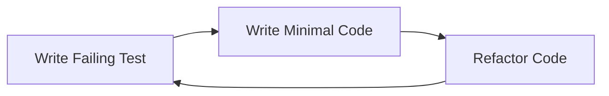

# TDD Workflow

Test-Driven Development workflow for reliable implementation.

## Core TDD Cycle



## Phase 1: RED - Write Failing Test

### Test Structure Template
```javascript
describe('Component/Feature', () => {
  describe('Specific Functionality', () => {
    it('should perform expected behavior', () => {
      // Arrange
      const input = setupTestData();

      // Act
      const result = functionUnderTest(input);

      // Assert
      expect(result).toEqual(expectedOutput);
    });
  });
});
```

### Test Categories
1. **Unit Tests**: Single function/method
2. **Integration Tests**: Component interaction
3. **E2E Tests**: Full workflow

### Test Naming Conventions
```python
def test_method_name_should_expected_behavior_when_condition():
    """
    Test: [Method Name]
    Should: [Expected Behavior]
    When: [Condition/Context]
    """
    pass
```

## Phase 2: GREEN - Minimal Implementation

### Implementation Rules
1. Write ONLY enough code to pass test
2. Don't add unrequested features
3. Hardcode if faster (refactor later)
4. Focus on making test green

### Quick Green Strategies
```python
# Strategy 1: Return hardcoded value
def get_user_count():
    return 5  # Just make test pass

# Strategy 2: Minimal logic
def calculate_discount(price):
    if price > 100:
        return price * 0.9
    return price

# Strategy 3: Simple implementation
def validate_email(email):
    return "@" in email  # Minimal validation
```

## Phase 3: REFACTOR - Improve Code

### Refactoring Checklist
- [ ] Remove duplication
- [ ] Improve naming
- [ ] Extract methods
- [ ] Simplify logic
- [ ] Apply patterns
- [ ] Update documentation

### Refactoring Patterns
```python
# Before: Duplication
def calculate_price_with_tax(price):
    tax = price * 0.08
    return price + tax

def calculate_price_with_discount(price):
    discount = price * 0.10
    return price - discount

# After: DRY
def apply_percentage(value, percentage, operation='add'):
    amount = value * percentage
    return value + amount if operation == 'add' else value - amount

def calculate_price_with_tax(price):
    return apply_percentage(price, 0.08, 'add')

def calculate_price_with_discount(price):
    return apply_percentage(price, 0.10, 'subtract')
```

## TDD Workflow Integration

### With Engineer Agent
```yaml
workflow:
  - step: Receive requirement
    agent: orchestrator

  - step: Write failing tests
    agent: tester
    output: test_suite.js

  - step: Implement minimal code
    agent: engineer
    input: test_suite.js
    output: implementation.js

  - step: Run tests
    agent: tester
    expected: all_green

  - step: Refactor
    agent: engineer
    maintain: green_tests

  - step: Review
    agent: reviewer
    verify: quality_standards
```

### Test-First Scenarios

```python
# Scenario 1: New Feature
def test_user_registration():
    # Write this FIRST
    user = register_user("test@example.com", "password123")
    assert user.id is not None
    assert user.email == "test@example.com"
    assert user.is_active == True

# THEN implement
def register_user(email, password):
    # Implementation to make test pass

# Scenario 2: Bug Fix
def test_handle_empty_cart_checkout():
    # Reproduce bug with test
    cart = ShoppingCart()
    with pytest.raises(EmptyCartError):
        cart.checkout()

# THEN fix
def checkout(self):
    if not self.items:
        raise EmptyCartError("Cannot checkout empty cart")
```

## Coverage Requirements

### Minimum Coverage Targets
```yaml
coverage:
  statements: 80%
  branches: 75%
  functions: 85%
  lines: 80%

critical_paths:
  authentication: 95%
  payment: 98%
  data_validation: 90%
```

### Coverage Commands
```bash
# JavaScript/Node
npm test -- --coverage

# Python
pytest --cov=src --cov-report=term-missing

# Go
go test -cover ./...

# Java
mvn test jacoco:report
```

## TDD Best Practices

### DO
- Write test before code
- Keep tests simple and focused
- Test behavior, not implementation
- Use descriptive test names
- Maintain test independence
- Mock external dependencies

### DON'T
- Test private methods directly
- Write tests after code
- Create interdependent tests
- Test framework code
- Over-mock (test real behavior)
- Ignore failing tests

## Test Data Management

```python
# Fixtures
@pytest.fixture
def sample_user():
    return User(
        email="test@example.com",
        name="Test User",
        role="standard"
    )

# Factories
class UserFactory:
    @staticmethod
    def create(**kwargs):
        defaults = {
            "email": "user@test.com",
            "name": "Test User",
            "active": True
        }
        defaults.update(kwargs)
        return User(**defaults)

# Builders
class UserBuilder:
    def __init__(self):
        self.user = User()

    def with_email(self, email):
        self.user.email = email
        return self

    def with_admin_role(self):
        self.user.role = "admin"
        return self

    def build(self):
        return self.user
```

## Integration with CI/CD

```yaml
# .github/workflows/tdd.yml
name: TDD Pipeline

on: [push, pull_request]

jobs:
  test:
    runs-on: ubuntu-latest
    steps:
      - uses: actions/checkout@v2

      - name: Run Tests
        run: |
          npm test
          npm run test:coverage

      - name: Check Coverage
        run: |
          if [ $(coverage) -lt 80 ]; then
            exit 1
          fi

      - name: Upload Coverage
        uses: codecov/codecov-action@v2
```