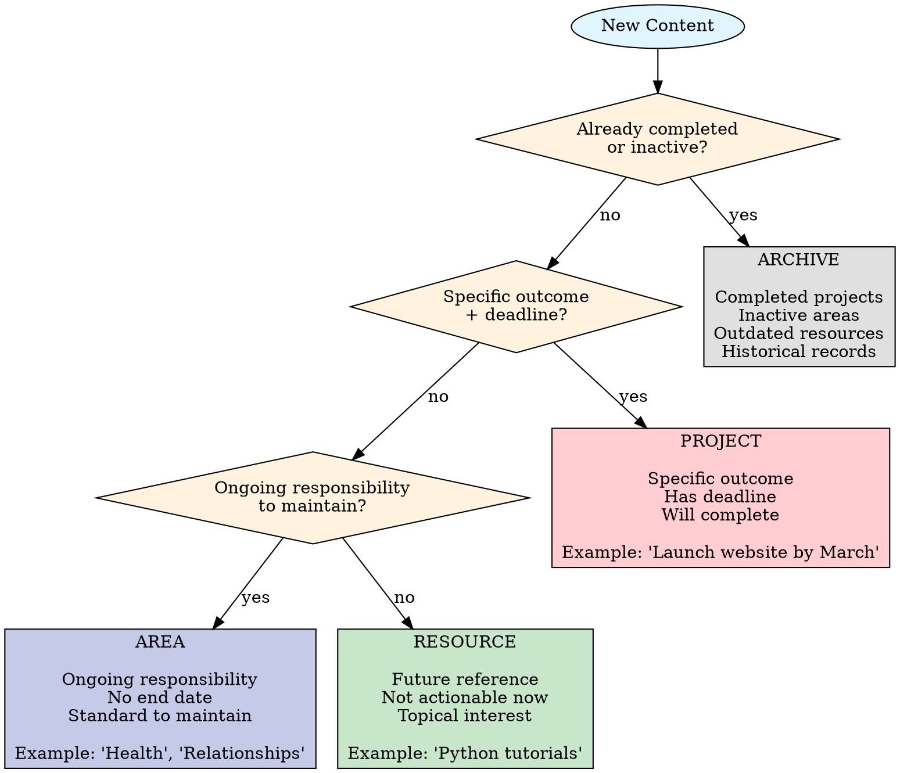

# PARA Classification Decisions

## Overview

**Organize by actionability (when/how you'll use it), not by topic.**

Wrong PARA placement breaks the system:
- Projects in Areas → Never get completed, clutter dashboards
- Areas in Projects → False completion, lose ongoing tracking
- Resources in Projects → Mix reference with action

**Core principle:** The PARA method is about TIME HORIZON, not subject matter.

## When to Use

**Use this skill when:**
- About to place a note and unsure if Project vs Area
- Content seems like it could fit multiple categories
- Creating note about ongoing responsibility (health, relationships, learning)
- User request is ambiguous ("I want to work on X")

**Especially when:**
- Topic is ongoing but user mentions goals (might be Project OR Area)
- Confusing "outcome" with "responsibility" (common with health, finance, relationships)
- Archive vs Resource decision (both are "not now" but different purposes)

## Classification Flowchart



## Decision Questions

### Question 1: Is this already done?

**YES** → **ARCHIVE**
- Completed project from last year
- No longer active responsibility
- Outdated information

**NO** → Continue to Question 2

### Question 2: Does this have a specific outcome AND deadline?

**Both YES** → **PROJECT**
- "Learn Python for data analysis by December 2025" ✓
- "Run marathon by June" ✓
- "Complete tax return by April 15" ✓

**Either NO** → Continue to Question 3

**Key:** Both "specific outcome" AND "deadline" must be true. One alone ≠ Project.

### Question 3: Is this an ongoing responsibility to maintain?

**YES** → **AREA**
- "Maintain health and fitness" ✓
- "Manage relationships with family" ✓
- "Keep finances organized" ✓

**NO** → **RESOURCE**
- "Collection of Python tutorials" ✓
- "Industry trend articles" ✓
- "Travel destination ideas" ✓

## Edge Cases Reference

| Statement | Seems Like | Actually Is | Reasoning |
|-----------|-----------|-------------|-----------|
| "Get healthy" | Project | **AREA** | No completion - ongoing responsibility |
| "Lose 10kg by June" | Area | **PROJECT** | Specific outcome + deadline |
| "Learn Python" | Project | **AREA or RESOURCE** | No deadline = not Project. Responsibility = Area. Interest only = Resource |
| "Learn Python by Dec 2025" | Area | **PROJECT** | Has deadline + specific outcome |
| "How to use X tool" | Area | **RESOURCE** | Reference material, not responsibility |
| "Meeting notes 2024-10-01" | Resource | **ARCHIVE** | Historical record of past event |
| "Plan vacation" (active) | Area | **PROJECT** | Has deadline (the trip date) |
| "Plan vacation" (ideas) | Project | **RESOURCE** | No specific trip = reference/ideas |
| "Family time" | Project | **AREA** | Ongoing responsibility, no completion |
| "Organize family reunion by August" | Area | **PROJECT** | Specific event + deadline |
| "Python course materials" | Area | **RESOURCE** | Reference, not practicing responsibility |
| "Daily Python practice" | Project | **AREA** | Ongoing habit, no end date |
| "Build Python portfolio by Q4" | Area | **PROJECT** | Specific deliverable + timeline |

## Dutch Areas (Your Vault)

**Private Vault (01-Private):**
- **Gezin** (Family) - Relationships, children, home life, family events
- **Gezondheid** (Health) - Medical, fitness, nutrition, mental health, recovery
- **Holdings en BVs** - Business entities, investments, corporate management
- **Knowledge Management** - Learning systems, tools, information architecture
- **Persoonlijke Ontwikkeling** - Skills, career growth, self-improvement
- **Prive Financien** - Personal money management, budgets, expenses

**Work Vault (02-POA):**
- **MT** (Management Team) - Leadership responsibilities
- **Beleid** (Policy) - Policy development and management
- **Governance** - Governance structures and processes

**If creating Area note:** Must match existing Area structure exactly.

## Common Misclassifications

### Misclassification Pattern 1: "Goal" → PROJECT (Wrong)

**Problem:** User says "goal" but actually describes ongoing responsibility

```markdown
❌ WRONG
User: "My goal is to maintain good health"
You: "Creating PROJECT: Maintain Good Health"

✅ CORRECT
User: "My goal is to maintain good health"
You: "This is an ongoing responsibility (no endpoint),
     creating AREA: Gezondheid

     Would you like a PROJECT for a specific health goal?
     E.g., 'Run 5K by November' or 'Lose 5kg by December'?"
```

### Misclassification Pattern 2: "Learn X" → PROJECT (Sometimes Wrong)

```markdown
❌ WRONG (no deadline)
User: "I want to learn Python"
You: "Creating PROJECT: Learn Python"

✅ CORRECT
You: "Learning Python - do you have:
     - Specific outcome? (e.g., build data analysis skills)
     - Deadline? (e.g., proficient by end of 2025)

     If YES to both → PROJECT
     If YES to outcome, NO to deadline → AREA (ongoing learning)
     If just interested → RESOURCE (save tutorials)"
```

### Misclassification Pattern 3: "Collection of X" → AREA (Wrong)

```markdown
❌ WRONG
User: "Collection of Python learning resources"
You: "Creating AREA: Python Learning"

✅ CORRECT
You: "Collection of resources (not practicing/maintaining),
     creating RESOURCE: Python Learning Materials

     If you're ACTIVELY learning with practice schedule → AREA
     If you're learning TOWARD specific goal by deadline → PROJECT"
```

## Decision Tree Shortcuts

**Has a completion checkbox?** → Probably PROJECT
**Will this be "done" someday?** → PROJECT if yes, AREA if no
**Am I collecting info or practicing?** → Collecting = RESOURCE, Practicing = AREA/PROJECT
**Past event?** → ARCHIVE
**Future one-time event?** → PROJECT
**Ongoing practice/responsibility?** → AREA

## Verification Checklist

Before finalizing classification:

- [ ] **For PROJECT: Can I write specific "Definition of Done"?**
  - If no → Not a Project

- [ ] **For AREA: Will I still be maintaining this next year?**
  - If no → Maybe PROJECT (if has deadline) or RESOURCE

- [ ] **For RESOURCE: Is this reference only, or am I actively doing something?**
  - If actively doing → AREA or PROJECT

- [ ] **For ARCHIVE: Is this truly inactive, or might I work on it soon?**
  - If might work on it → Keep in active category

## Red Flags - Reconsider Classification

If you catch yourself thinking:
- "This Area will be complete when..." → **Not an AREA, it's a PROJECT**
- "This Project is ongoing..." → **Not a PROJECT, it's an AREA**
- "This Resource I'm actively working on..." → **Not a RESOURCE, it's AREA/PROJECT**
- "I'll archive this but revisit monthly..." → **Not archived, it's active**
- "User said 'goal' so it must be Project..." → **NO. Goals can be ongoing (AREA)**

**ALL of these mean: Rethink classification using flowchart.**

## Integration with Other Skills

**Called by:**
- skills/obsidian/vault-creating-obsidian-notes (Phase 2 - Classification)

**Calls:**
- None (uses flowchart logic only)

## Special Case: Work vs Personal

**Same topic, different PARA category based on context:**

| Topic | Personal | Work |
|-------|----------|------|
| Learning Python | AREA: Persoonlijke Ontwikkeling | PROJECT: Develop data analysis capability (if work deadline) |
| Health | AREA: Gezondheid | N/A (personal only) |
| Meeting notes | ARCHIVE: (if personal meeting) | ARCHIVE: 02-POA (if work meeting) |

**Rule:** Vault location (01-Private vs 02-POA) determined by who benefits, not by topic.

## Examples with Reasoning

### Example 1: "I want to maintain consistent CrossFit practice"

**Analysis:**
- Specific outcome? → NO (no measurable completion)
- Deadline? → NO (ongoing)
- Ongoing responsibility? → YES (practice requires maintenance)

**Classification:** **AREA: Gezondheid/Fitness**

**If user adds:** "I want to compete in CrossFit Open by February"
→ Now it's **PROJECT** (specific outcome + deadline)

### Example 2: "Collection of Tim Ferriss podcast notes"

**Analysis:**
- Specific outcome? → NO (collection, not goal)
- Deadline? → NO
- Ongoing responsibility? → NO (reference material)

**Classification:** **RESOURCE: Personal Development/Productivity**

### Example 3: "Plan family vacation to Spain"

**Analysis (ambiguous - need clarification):**

**If trip is booked (August 2025):**
- Specific outcome? → YES (vacation happens)
- Deadline? → YES (August 2025)
→ **PROJECT**

**If just dreaming/collecting ideas:**
- Specific outcome? → NO (no actual trip planned)
- Ongoing responsibility? → NO (just ideas)
→ **RESOURCE: Travel Ideas**

**Ask user:** "Is this a confirmed trip with dates? Or collecting ideas for future?"

## Success Criteria

You know classification worked when:
- **PROJECT** has Definition of Done and deadline in frontmatter
- **AREA** has no end date, defines standards to maintain
- **RESOURCE** is clearly reference-only, not actionable now
- **ARCHIVE** is confirmed inactive (completion date in frontmatter)

## Remember

**PARA is about TIME HORIZON and ACTIONABILITY, not topics.**

The same topic (Python, Health, Family) can exist in ALL FOUR categories depending on context:
- **PROJECT:** "Learn Python for data analysis by Dec 2025"
- **AREA:** "Python Development" (ongoing practice/skill maintenance)
- **RESOURCE:** "Python Tutorial Collection" (reference materials)
- **ARCHIVE:** "Python Basics Course 2023" (completed learning)

Use the flowchart. Every time.
