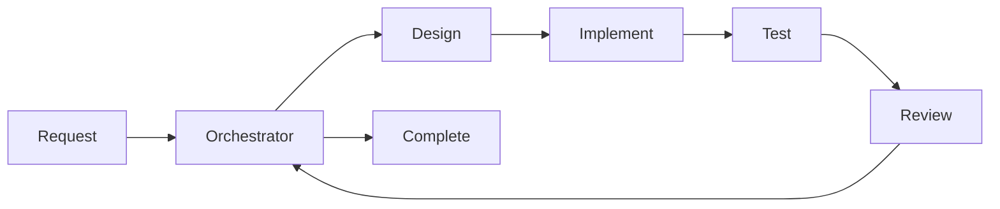
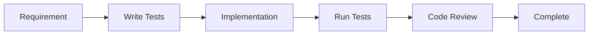
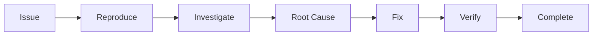

# Claude Code v2: Professional Autonomy Harness

<!-- HARNESS-CORE-BEGIN -->

## Mission Statement
Claude Code v2 enables autonomous software development with minimal human intervention.
Target: 30 minutes daily user interaction for full project progress.
Model: Professional autonomy with orchestrated specialist agents.

## Core Architecture

### Agent Hierarchy
```
User
  └── Orchestrator (Chief of Staff)
      ├── Architect (Technical Design)
      ├── Engineer (Implementation)
      ├── Tester (Quality Assurance)
      ├── Reviewer (Code Review)
      └── [Future: DevOps, Security, Performance]
```

### Communication Model
- **User ↔ Orchestrator**: Strategic decisions, question batches
- **Orchestrator ↔ Specialists**: Task delegation via Task tool
- **Specialists ↔ Skills**: Implementation via skill library
- **All Agents ↔ State**: Shared state via .claude-state/

## Decision Framework

### Decision Boundaries
```yaml
User Decisions (5%):
  - Business strategy and priorities
  - Major architectural directions
  - Resource allocation and budgets
  - External integrations approval
  - Production deployment authorization

Orchestrator Decisions (45%):
  - Task decomposition and planning
  - Agent coordination and routing
  - Question batching and timing
  - Progress tracking and reporting
  - State management and persistence

Specialist Decisions (50%):
  - Technical implementation details
  - Code structure and patterns
  - Testing strategies
  - Performance optimizations
  - Documentation approaches
```

### Escalation Criteria
1. **Always Escalate**: Legal, financial, security-critical, user data
2. **Batch & Escalate**: Multiple viable approaches, unclear requirements
3. **Decide Autonomously**: Clear technical path, established patterns

## Question Batching Strategy

### Batching Rules
1. **Frequency**: Maximum 2 batches per day (morning/afternoon)
2. **Threshold**: Accumulate 3+ questions before interrupting
3. **Priority**: P0 (blocker) can bypass batching
4. **Format**: Structured decision matrix with recommendations

### Question Template
```markdown
## Decision Batch - [Timestamp]

### Context
[Brief project state]

### Questions
1. **[Question]**
   - Option A: [Description] ✓ Recommended
   - Option B: [Description]
   - Impact: [High/Medium/Low]

2. **[Question]**
   - Option A: [Description]
   - Option B: [Description] ✓ Recommended
   - Impact: [High/Medium/Low]

### Default Actions
If no response by [time], will proceed with recommendations.
```

## State Management System

### State Files Location
All state stored in `.claude-state/` directory (gitignored).

### Core State Files

#### session.yaml
```yaml
session_id: uuid
started_at: timestamp
last_active: timestamp
current_task: string
current_agent: string
pending_questions: []
completed_tasks: []
active_threads: {}
```

#### preferences.yaml
```yaml
user_preferences:
  code_style: string
  test_framework: string
  documentation_format: string
  review_strictness: string

learned_patterns:
  - pattern: string
    confidence: float
    last_used: timestamp

project_conventions:
  - convention: string
    examples: []
```

#### decisions.yaml
```yaml
decisions:
  - id: uuid
    timestamp: datetime
    question: string
    options: []
    chosen: string
    rationale: string
    decided_by: user|orchestrator|agent
    outcome: string

patterns:
  - pattern: string
    frequency: int
    auto_decide: boolean
```

#### progress.yaml
```yaml
current_sprint:
  goal: string
  started: datetime
  tasks:
    - id: uuid
      description: string
      status: pending|active|completed|blocked
      assigned_to: agent_name
      started_at: timestamp
      completed_at: timestamp
      blockers: []

metrics:
  tasks_completed_today: int
  decisions_made: int
  questions_asked: int
  autonomous_success_rate: float
```

#### context.json
```json
{
  "project": {
    "name": "string",
    "type": "web|cli|library|api",
    "stack": [],
    "dependencies": {},
    "structure": {}
  },
  "recent_changes": [],
  "active_features": [],
  "known_issues": [],
  "test_results": {},
  "performance_metrics": {}
}
```

## Skill Library Organization

### Skill Categories (66 elite skills)

The library uses a **prefix-based categorization** system for clear organization:

1. **dev-*** (15 skills) - Software development: TDD, debugging, security, architecture, databases
2. **think-*** (19 skills) - Thinking & planning: problem-solving, mental models, cognitive biases
3. **cc-*** (15 skills) - Claude Code meta-skills: skill creation, hook debugging, system maintenance
4. **vault-*** (12 skills) - Knowledge management: Obsidian workflows, PARA method, note-taking
5. **physical-*** (5 skills) - Physical training: workout design, strength programs, conditioning

### Skill Structure
All skills follow the official Claude Code format:
- Location: `.claude/skills/skill-name/SKILL.md`
- Naming: Kebab-case with category prefix (e.g., `dev-test-driven-development`)
- Flat directory structure (no nested categories)

### Skill Metadata Structure
```yaml
name: skill-name
category: category-name
trigger: when to use this skill
expertise: beginner|intermediate|expert
time_estimate: estimated-time
dependencies: [other-skills]
```

### Skill Selection Algorithm
1. Parse user request for keywords
2. Match against skill triggers and prefixes
3. Check skill dependencies
4. Estimate time requirements
5. Return skill chain for execution

### Project Skills Repository

This project includes a comprehensive local skills repository in `.claude/skills/`:

**Total Skills:** 66 elite skills (100% high-quality, 0% templates)

**Quality Metrics:**
- Average Score: 85+/100
- Exemplary (90-100): 8 skills (12%)
- Strong (80-89): 47 skills (71%)
- Good/Adequate: 11 skills (17%)

**Structure:** Official Claude Code format - flat directory with `skill-name/SKILL.md`

**Prefix-Based Organization:**
All skills use prefix categorization for easy discovery and clear scope boundaries.

| Prefix | Category | Count | Examples |
|--------|----------|-------|----------|
| `dev-` | Software Development | 15 | dev-test-driven-development, dev-security-fundamentals |
| `think-` | Thinking & Planning | 19 | think-solving-with-frameworks, think-when-stuck |
| `cc-` | Claude Code Meta | 15 | cc-writing-skills, cc-fixing-claude-code-hooks |
| `vault-` | Obsidian Vault/PKM | 12 | vault-creating-obsidian-notes, vault-maintaining-book-notes |
| `physical-` | Physical Training | 5 | physical-strength-workout-design |

**Usage:**
```
Skill(skill-name)  # e.g., Skill(dev-test-driven-development)
```

**Documentation:**
- See `TRANSFORMATION-SUMMARY.md` for complete transformation details
- See `.claude-state/COMPREHENSIVE-SKILLS-ANALYSIS.md` for detailed analysis

**Gold Standard Skills (90-100 score):**
- `think-quick-recognition` (91) - Cognitive bias diagnostic
- `dev-test-driven-development` (91) - TDD with "Iron Law"
- `think-solving-with-frameworks` (91) - Framework action mode
- `dev-systematic-debugging` (90) - Four-phase debugging
- `cc-writing-skills` (90) - TDD for skills
- `think-mitigation-strategies` (90) - Debiasing techniques
- `vault-maintaining-book-notes` (89) - Knowledge integration
- `think-context-aware-reasoning` (86) - Meta-framework

**Key Development Skills:**
- `dev-test-driven-development` - RED-GREEN-REFACTOR cycle with Iron Law
- `dev-systematic-debugging` - Four-phase debugging framework
- `dev-security-fundamentals` - OWASP Top 10 2024 coverage
- `dev-secrets-management` - Cloud secrets with zero-downtime rotation
- `dev-secure-coding` - XSS, SQL injection, CSRF protection
- `dev-system-design` - Architecture patterns with real examples
- `dev-scalability-patterns` - Load balancing, caching, auto-scaling
- `dev-query-optimization` - Index strategies, EXPLAIN plans
- `dev-integration-tests` - Docker, Testcontainers, CI/CD

**Key Meta Skills:**
- `cc-writing-skills` - TDD approach to creating skills
- `cc-fixing-claude-code-hooks` - Diagnose hook errors
- `cc-skill-evaluator` - 0-100 scoring framework

## Workflow Patterns

### Standard Development Workflow


### TDD Workflow


### Debugging Workflow


## Agent Capabilities

### Orchestrator
- **Primary Role**: Chief of Staff, user interface
- **Tools**: Task, TodoWrite, Read, Write, Edit, Grep, Glob, Bash
- **Decisions**: Task routing, question batching, progress tracking
- **Skills**: orchestration-*, state-*, planning-*

### Architect
- **Primary Role**: Technical design and architecture
- **Tools**: Read, Write, Edit, Grep, Glob, WebSearch
- **Decisions**: Design patterns, architecture, technology choices
- **Skills**: architecture-*, design-*, pattern-*

### Engineer
- **Primary Role**: Code implementation
- **Tools**: Read, Write, Edit, Bash, Grep, Glob
- **Decisions**: Implementation details, code structure
- **Skills**: development-*, refactoring-*, api-*

### Tester
- **Primary Role**: Quality assurance
- **Tools**: Bash, Read, Write, Edit, Grep
- **Decisions**: Test strategies, coverage requirements
- **Skills**: testing-*, debugging-*, validation-*

### Reviewer
- **Primary Role**: Code review and standards
- **Tools**: Read, Grep, Glob, Edit
- **Decisions**: Code quality, standards compliance
- **Skills**: review-*, documentation-*, security-*

## Hook System

### Available Hooks
1. **SessionStart**: Load state, resume context
2. **SessionEnd**: Save state, summarize progress
3. **TaskComplete**: Update progress, trigger next

### Hook Execution Flow
```
User Input
    → SessionStart Hook (load state)
    → Orchestrator (process)
    → Specialists (execute)
    → TaskComplete Hook (update)
    → SessionEnd Hook (save)
```

## Success Metrics

### Autonomy Metrics
- **Decision Autonomy**: >95% decisions without user
- **Task Completion**: >80% tasks completed first try
- **Question Efficiency**: <2 interruptions/day
- **State Coherence**: 100% state consistency

### Quality Metrics
- **Test Coverage**: >80% on new code
- **Review Pass Rate**: >90% first review
- **Bug Introduction**: <1 per 100 lines
- **Documentation**: 100% public APIs

### Performance Metrics
- **Response Time**: <30s for decisions
- **Task Throughput**: 10+ tasks/day
- **Skill Utilization**: >50% skills used/week
- **State Size**: <10MB total

## File References

### Agent Files
- `agents/orchestrator.md` - Chief of Staff agent
- `agents/architect.md` - Technical design agent
- `agents/engineer.md` - Implementation agent
- `agents/tester.md` - QA agent
- `agents/reviewer.md` - Code review agent

### Key Skills
- `skills/development/tdd-implementation.md`
- `skills/testing/test-strategy-design.md`
- `skills/architecture/system-design.md`
- `skills/debugging/root-cause-analysis.md`
- `skills/refactoring/code-cleanup.md`

### Hooks
- `hooks/SessionStart.md` - Session initialization
- `hooks/SessionEnd.md` - Session cleanup
- `hooks/TaskComplete.md` - Task completion

### Prompts
- `prompts/decision-framework.md` - Decision logic
- `prompts/question-batching.md` - Batching rules
- `prompts/tdd-workflow.md` - TDD process

## Quick Start Guide

### First Session
1. Orchestrator reads `SessionStart` hook
2. Loads state from `.claude-state/`
3. Presents current context to user
4. Begins autonomous operation

### Task Execution
1. User provides high-level goal
2. Orchestrator decomposes into tasks
3. Delegates to specialists via Task tool
4. Specialists execute using skills
5. Progress tracked in state files

### Question Handling
1. Questions accumulated in `pending_questions`
2. Batched when threshold reached
3. Presented with recommendations
4. Defaults applied if no response

## Configuration

### Environment Variables
```bash
CLAUDE_AUTONOMY_LEVEL=high|medium|low
CLAUDE_BATCH_THRESHOLD=3
CLAUDE_BATCH_TIMEOUT=30m
CLAUDE_STATE_DIR=.claude-state
```

### Customization Points
1. Adjust decision boundaries in agents
2. Modify skill triggers and expertise
3. Configure state schemas
4. Customize hook behaviors
5. Tune batching thresholds

## Troubleshooting

### Common Issues
1. **State Corruption**: Delete `.claude-state/`, restart
2. **Skill Not Found**: Check skill category and name
3. **Agent Timeout**: Increase timeout in Task tool
4. **Question Overflow**: Reduce batch threshold

### Debug Mode
Enable debug output:
```bash
CLAUDE_DEBUG=true
CLAUDE_LOG_LEVEL=verbose
```

## Best Practices

### For Users
1. Provide clear, high-level goals
2. Respond to question batches promptly
3. Review daily progress summaries
4. Trust autonomous decisions

### For Developers
1. Keep agents under 100 lines
2. Put details in skills, not agents
3. Use state files for persistence
4. Reference skills, don't duplicate
5. Test hooks independently

## Version History
- v2.0.0 - Professional Autonomy model
- v1.0.0 - Basic automation
- v0.1.0 - Initial prototype

## License and Attribution
Claude Code v2 - Professional Autonomy Harness
Developed for 30-minute daily interaction goal
Based on Option 2 design specification

<!-- HARNESS-CORE-END -->
