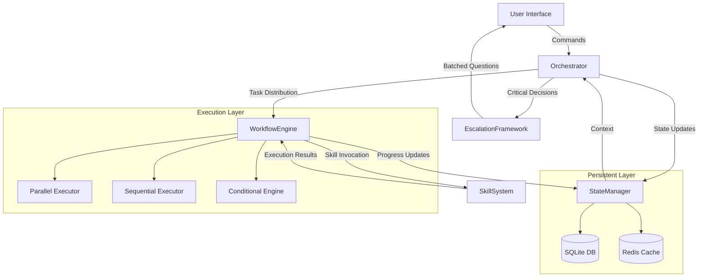

# System Architecture - Option 2: Professional Autonomy

## 1. Executive Summary

The Professional Autonomy system is designed to operate autonomously for full-day work sessions with minimal user intervention. The architecture prioritizes:
- **Autonomous operation**: 95% of decisions made without user input
- **State persistence**: Complete context preservation across sessions
- **Process intelligence**: Sophisticated task decomposition and execution
- **Strategic checkpoints**: User engagement only for critical decisions

## 2. High-Level Architecture

### 2.1 System Components

```yaml
components:
  core:
    orchestrator:
      purpose: Central control and coordination
      location: .claude/orchestrator/
      runtime: Python 3.11+
      memory: 512MB allocated

    state_manager:
      purpose: Persistent state and context
      location: .claude/state/
      database: SQLite + Redis
      backup: Incremental every 5 minutes

    workflow_engine:
      purpose: Complex workflow execution
      location: .claude/workflows/
      runtime: AsyncIO-based
      parallelism: Up to 10 concurrent workflows

    skill_system:
      purpose: Specialized task execution
      location: .claude/skills/
      count: 150 core skills
      loading: Lazy-loaded on demand

    escalation_framework:
      purpose: Intelligent user engagement
      location: .claude/escalation/
      threshold: 5% of decisions
      batching: Up to 5 questions per session

  interfaces:
    claude_api:
      type: REST + WebSocket
      port: 8765
      authentication: JWT tokens

    cli_interface:
      type: Interactive terminal
      framework: Rich/Textual

    web_dashboard:
      type: Optional monitoring UI
      port: 8766
      framework: FastAPI + HTMX
```

### 2.2 Component Interaction Diagram



## 3. Data Flow Patterns

### 3.1 Request Processing Pipeline

```python
class RequestPipeline:
    """Main request processing flow"""

    def __init__(self):
        self.stages = [
            ('parse', self.parse_request),
            ('contextualize', self.load_context),
            ('decompose', self.decompose_task),
            ('plan', self.create_execution_plan),
            ('validate', self.validate_plan),
            ('execute', self.execute_plan),
            ('persist', self.save_state),
            ('report', self.generate_report)
        ]

    async def process(self, request: dict) -> dict:
        """Process request through all stages"""
        context = {
            'request_id': generate_uuid(),
            'timestamp': datetime.utcnow(),
            'request': request,
            'metrics': {}
        }

        for stage_name, stage_func in self.stages:
            start_time = time.perf_counter()
            try:
                context = await stage_func(context)
                context['metrics'][stage_name] = {
                    'duration': time.perf_counter() - start_time,
                    'status': 'success'
                }
            except Exception as e:
                context['metrics'][stage_name] = {
                    'duration': time.perf_counter() - start_time,
                    'status': 'failed',
                    'error': str(e)
                }
                await self.handle_stage_failure(stage_name, context, e)

        return context
```

### 3.2 State Synchronization Flow

```yaml
state_sync:
  write_path:
    - User Action
    - Orchestrator Processing
    - State Manager Update
    - SQLite Write (primary)
    - Redis Cache Update (performance)
    - Backup Queue (durability)

  read_path:
    - Request Received
    - Redis Cache Check (10ms timeout)
    - SQLite Fallback (if cache miss)
    - Context Reconstruction
    - Return to Orchestrator

  consistency_model:
    type: Eventually Consistent
    max_lag: 500ms
    conflict_resolution: Last-Write-Wins

  backup_strategy:
    frequency: 5 minutes
    type: Incremental
    location: .claude/backups/
    retention: 30 days
    compression: zstd
```

## 4. Technology Stack Decisions

### 4.1 Core Technologies

```yaml
runtime:
  language: Python 3.11+
  reasoning:
    - Native async/await support
    - Rich ecosystem for AI/ML integrations
    - Claude SDK native support
    - Type hints for maintainability

persistence:
  primary: SQLite
  reasoning:
    - Zero configuration
    - ACID compliance
    - Embedded (no separate process)
    - Excellent for single-user workloads

  cache: Redis
  reasoning:
    - Sub-millisecond latency
    - Native data structures
    - Pub/sub for real-time updates
    - Optional (graceful degradation)

orchestration:
  framework: Custom AsyncIO-based
  reasoning:
    - Fine-grained control
    - Native Python integration
    - No external dependencies
    - Optimized for our use case

workflow:
  engine: Custom DSL with YAML
  reasoning:
    - Human-readable definitions
    - Version control friendly
    - Easy skill composition
    - Runtime validation
```

### 4.2 Dependencies

```toml
[dependencies]
# Core
python = "^3.11"
pydantic = "^2.5.0"  # Data validation
asyncio = "*"        # Async runtime
aiofiles = "^23.2.1" # Async file operations

# Persistence
aiosqlite = "^0.19.0"  # Async SQLite
redis = "^5.0.1"       # Cache layer
alembic = "^1.13.0"    # Database migrations

# Claude Integration
anthropic = "^0.21.0"  # Claude API
claude-sdk = "^1.0.0"  # Official SDK

# Utilities
pyyaml = "^6.0.1"      # Configuration
loguru = "^0.7.2"      # Structured logging
httpx = "^0.25.0"      # HTTP client
tenacity = "^8.2.3"    # Retry logic
pytz = "^2024.1"       # Timezone handling

# Monitoring
prometheus-client = "^0.19.0"  # Metrics
opentelemetry = "^1.22.0"      # Tracing

# Testing
pytest = "^7.4.0"
pytest-asyncio = "^0.21.0"
pytest-cov = "^4.1.0"
```

## 5. Integration Points

### 5.1 Claude Code Integration

```python
class ClaudeIntegration:
    """Integration with Claude Code CLI"""

    def __init__(self, config: dict):
        self.base_path = Path("~/.claude").expanduser()
        self.config_path = self.base_path / "config.yaml"
        self.socket_path = self.base_path / "orchestrator.sock"

    async def register_orchestrator(self):
        """Register orchestrator with Claude Code"""
        registration = {
            "component": "orchestrator",
            "version": "2.0.0",
            "capabilities": [
                "autonomous_execution",
                "state_persistence",
                "workflow_management",
                "skill_orchestration"
            ],
            "endpoints": {
                "websocket": "ws://localhost:8765",
                "rest": "http://localhost:8765/api",
                "health": "http://localhost:8765/health"
            }
        }

        # Write registration to Claude Code config
        async with aiofiles.open(self.config_path, 'a') as f:
            await f.write(f"\n# Orchestrator Registration\n")
            await f.write(yaml.dump({"orchestrator": registration}))
```

### 5.2 External Services

```yaml
external_integrations:
  git:
    operations: [clone, pull, push, commit, branch]
    authentication: SSH keys or tokens
    rate_limit: None

  github_api:
    operations: [issues, PRs, reviews, actions]
    authentication: Personal access token
    rate_limit: 5000/hour

  filesystem:
    operations: [read, write, watch, search]
    permissions: User-level
    monitoring: inotify (Linux), FSEvents (macOS)

  network:
    allowed_protocols: [HTTP, HTTPS, WebSocket]
    proxy_support: Environment variables
    timeout_default: 30 seconds

  llm_providers:
    primary: Claude (Anthropic)
    fallback: Local models (optional)
    rate_limit: Per API agreement
```

## 6. System Boundaries

### 6.1 Scope Definition

```yaml
in_scope:
  - Task orchestration and coordination
  - State management and persistence
  - Workflow execution
  - Skill invocation and management
  - Error handling and recovery
  - User escalation for critical decisions
  - Performance monitoring
  - Audit logging

out_of_scope:
  - Direct code execution (handled by skills)
  - UI rendering (delegated to Claude Code)
  - Authentication (inherited from CLI)
  - Cloud synchronization
  - Multi-user collaboration
  - Real-time collaboration

boundary_interfaces:
  north: User Interface (CLI/Web)
  south: File System & External APIs
  east: Claude API & LLM Services
  west: Development Tools & IDEs
```

### 6.2 Security Boundaries

```python
class SecurityBoundary:
    """Define and enforce security boundaries"""

    ALLOWED_PATHS = [
        Path.home() / "projects",
        Path.home() / ".claude",
        Path("/tmp/claude-work")
    ]

    BLOCKED_PATHS = [
        Path("/etc"),
        Path("/sys"),
        Path("/proc"),
        Path.home() / ".ssh",
        Path.home() / ".aws"
    ]

    @staticmethod
    def validate_path(path: Path) -> bool:
        """Validate file access is within boundaries"""
        resolved = path.resolve()

        # Check blocklist first
        for blocked in SecurityBoundary.BLOCKED_PATHS:
            if resolved.is_relative_to(blocked):
                raise SecurityException(f"Access denied: {path}")

        # Check allowlist
        for allowed in SecurityBoundary.ALLOWED_PATHS:
            if resolved.is_relative_to(allowed):
                return True

        # Default deny
        raise SecurityException(f"Path outside boundaries: {path}")
```

## 7. Performance Characteristics

### 7.1 Performance Targets

```yaml
latency_targets:
  user_command_acknowledgment: <100ms
  context_load: <200ms
  simple_task_completion: <2s
  complex_workflow_start: <5s
  state_save: <50ms
  cache_hit: <10ms
  database_query: <100ms
  skill_load: <500ms

throughput_targets:
  concurrent_workflows: 10
  tasks_per_minute: 100
  state_updates_per_second: 1000
  skill_executions_parallel: 5

resource_limits:
  memory_total: 2GB
  memory_per_workflow: 200MB
  cpu_cores: 4
  disk_io_burst: 100MB/s
  network_bandwidth: 10Mbps
```

### 7.2 Performance Optimization

```python
class PerformanceOptimizer:
    """Runtime performance optimization"""

    def __init__(self):
        self.metrics = defaultdict(list)
        self.cache = LRUCache(maxsize=1000)

    async def optimize_query(self, query: str) -> str:
        """Optimize database queries"""
        # Query plan caching
        if cached_plan := self.cache.get(query):
            return cached_plan

        # Analyze and optimize
        optimized = await self.analyze_query(query)

        # Add indexes if beneficial
        if self.should_add_index(optimized):
            await self.create_index(optimized)

        self.cache[query] = optimized
        return optimized

    async def adaptive_batching(self, tasks: list) -> list:
        """Dynamically batch tasks for optimal throughput"""
        # Measure current system load
        cpu_usage = psutil.cpu_percent(interval=0.1)
        memory_available = psutil.virtual_memory().available

        # Calculate optimal batch size
        if cpu_usage < 50 and memory_available > 1024 * 1024 * 1024:  # 1GB
            batch_size = 10
        elif cpu_usage < 75:
            batch_size = 5
        else:
            batch_size = 1

        # Return batched tasks
        return [tasks[i:i+batch_size]
                for i in range(0, len(tasks), batch_size)]
```

## 8. Security Model Overview

### 8.1 Security Architecture

```yaml
security_layers:
  authentication:
    method: Inherited from Claude CLI
    token_type: JWT
    expiration: 24 hours
    refresh: Automatic

  authorization:
    model: Role-based (RBAC)
    roles:
      - admin: Full system access
      - user: Standard operations
      - readonly: Monitoring only

  encryption:
    at_rest:
      algorithm: AES-256-GCM
      key_management: OS keychain
      databases: Encrypted SQLite

    in_transit:
      internal: TLS 1.3
      external: HTTPS only
      websocket: WSS with auth

  audit:
    events: All state changes
    storage: Append-only log
    retention: 90 days
    format: JSON structured
```

### 8.2 Security Implementation

```python
class SecurityManager:
    """Core security implementation"""

    def __init__(self):
        self.encryptor = Fernet(self.load_key())
        self.audit_log = AuditLogger()

    def load_key(self) -> bytes:
        """Load or generate encryption key"""
        key_path = Path("~/.claude/security/master.key").expanduser()

        if key_path.exists():
            with open(key_path, 'rb') as f:
                return f.read()
        else:
            # Generate new key
            key = Fernet.generate_key()
            key_path.parent.mkdir(parents=True, exist_ok=True)

            # Secure permissions (owner only)
            with open(key_path, 'wb') as f:
                f.write(key)
            os.chmod(key_path, 0o600)

            return key

    def encrypt_sensitive(self, data: str) -> str:
        """Encrypt sensitive data"""
        return self.encryptor.encrypt(data.encode()).decode()

    def decrypt_sensitive(self, encrypted: str) -> str:
        """Decrypt sensitive data"""
        return self.encryptor.decrypt(encrypted.encode()).decode()

    async def audit_action(self, action: dict):
        """Log security-relevant action"""
        audit_entry = {
            'timestamp': datetime.utcnow().isoformat(),
            'action': action['type'],
            'user': action.get('user', 'system'),
            'details': action.get('details', {}),
            'result': action.get('result', 'unknown'),
            'ip_address': action.get('ip', 'localhost'),
            'session_id': action.get('session_id')
        }

        await self.audit_log.write(audit_entry)
```

## 9. Error Handling Strategy

### 9.1 Error Classification

```python
class ErrorClassification:
    """Classify and route errors appropriately"""

    RECOVERABLE = [
        'NetworkTimeout',
        'RateLimitExceeded',
        'TemporaryResourceUnavailable',
        'SkillLoadFailure'
    ]

    USER_ESCALATION = [
        'AmbiguousIntent',
        'InsufficientPermissions',
        'RequiredParameterMissing',
        'ConflictingRequirements'
    ]

    FATAL = [
        'SystemCorruption',
        'SecurityBreach',
        'DataLoss',
        'UnrecoverableState'
    ]

    @classmethod
    def classify(cls, error: Exception) -> str:
        """Classify error for appropriate handling"""
        error_type = type(error).__name__

        if error_type in cls.RECOVERABLE:
            return 'recoverable'
        elif error_type in cls.USER_ESCALATION:
            return 'escalate'
        elif error_type in cls.FATAL:
            return 'fatal'
        else:
            # Unknown errors are escalated for safety
            return 'escalate'
```

### 9.2 Recovery Mechanisms

```python
class RecoveryManager:
    """Implement recovery strategies for different error types"""

    def __init__(self):
        self.retry_policy = {
            'max_attempts': 3,
            'backoff_base': 2,
            'max_delay': 30
        }

    async def recover(self, error: Exception, context: dict) -> dict:
        """Attempt to recover from error"""
        classification = ErrorClassification.classify(error)

        if classification == 'recoverable':
            return await self.handle_recoverable(error, context)
        elif classification == 'escalate':
            return await self.escalate_to_user(error, context)
        elif classification == 'fatal':
            return await self.handle_fatal(error, context)

    @retry(
        stop=stop_after_attempt(3),
        wait=wait_exponential(multiplier=1, max=30),
        reraise=True
    )
    async def handle_recoverable(self, error: Exception, context: dict):
        """Handle recoverable errors with retry logic"""
        self.logger.warning(f"Recoverable error, attempting retry: {error}")

        # Implement recovery based on error type
        if isinstance(error, NetworkTimeout):
            # Increase timeout for retry
            context['timeout'] *= 2
        elif isinstance(error, RateLimitExceeded):
            # Wait for rate limit reset
            await asyncio.sleep(error.reset_after)

        # Retry the operation
        return await self.retry_operation(context)
```

## 10. Monitoring and Observability

### 10.1 Metrics Collection

```python
class MetricsCollector:
    """Collect and expose system metrics"""

    def __init__(self):
        # Prometheus metrics
        self.request_counter = Counter(
            'orchestrator_requests_total',
            'Total requests processed',
            ['status', 'type']
        )

        self.latency_histogram = Histogram(
            'orchestrator_latency_seconds',
            'Request latency',
            ['operation']
        )

        self.active_workflows = Gauge(
            'orchestrator_active_workflows',
            'Currently active workflows'
        )

        self.error_counter = Counter(
            'orchestrator_errors_total',
            'Total errors encountered',
            ['type', 'severity']
        )

    async def record_request(self, request_type: str, duration: float, status: str):
        """Record request metrics"""
        self.request_counter.labels(status=status, type=request_type).inc()
        self.latency_histogram.labels(operation=request_type).observe(duration)
```

### 10.2 Logging Architecture

```yaml
logging:
  structure:
    format: JSON
    timestamp: ISO8601 with timezone
    correlation_id: UUID per request

  levels:
    DEBUG: Development only
    INFO: Normal operations
    WARNING: Degraded performance
    ERROR: Failures requiring intervention
    CRITICAL: System-wide issues

  destinations:
    console:
      level: INFO
      format: Human-readable

    file:
      path: .claude/logs/orchestrator.log
      level: DEBUG
      rotation: 100MB
      retention: 7 days

    metrics:
      backend: Prometheus
      port: 9090
      path: /metrics
```

## 11. System Initialization

### 11.1 Bootstrap Sequence

```python
class SystemBootstrap:
    """Initialize all system components in correct order"""

    async def initialize(self):
        """Full system initialization"""
        steps = [
            ('config', self.load_configuration),
            ('security', self.initialize_security),
            ('database', self.initialize_database),
            ('cache', self.initialize_cache),
            ('state', self.restore_state),
            ('skills', self.load_skills),
            ('workflows', self.load_workflows),
            ('orchestrator', self.start_orchestrator),
            ('api', self.start_api_server),
            ('monitoring', self.start_monitoring)
        ]

        for step_name, step_func in steps:
            self.logger.info(f"Initializing: {step_name}")
            try:
                await step_func()
                self.logger.info(f"✓ {step_name} initialized")
            except Exception as e:
                self.logger.error(f"✗ {step_name} failed: {e}")
                await self.cleanup_partial_init(step_name)
                raise SystemInitError(f"Failed at {step_name}: {e}")

        self.logger.info("System initialization complete")
        return True
```

### 11.2 Configuration Schema

```yaml
# .claude/orchestrator/config.yaml
system:
  version: "2.0.0"
  mode: professional_autonomy

performance:
  max_concurrent_workflows: 10
  max_parallel_skills: 5
  cache_size_mb: 512
  state_checkpoint_interval: 300  # seconds

persistence:
  database:
    type: sqlite
    path: .claude/state/orchestrator.db
    connection_pool_size: 10

  cache:
    type: redis
    host: localhost
    port: 6379
    db: 0

  backup:
    enabled: true
    interval: 300  # seconds
    location: .claude/backups/
    retention_days: 30

escalation:
  threshold_percentage: 5
  batch_size: 5
  timeout_seconds: 300

skills:
  directory: .claude/skills/
  preload: []  # Skills to load on startup
  lazy_load: true

monitoring:
  metrics_port: 9090
  log_level: INFO
  trace_sampling_rate: 0.1
```

## 12. Deployment Architecture

### 12.1 Deployment Options

```yaml
deployment_modes:
  local:
    description: Single-user local installation
    requirements:
      - Python 3.11+
      - 4GB RAM minimum
      - 10GB disk space
      - Unix-like OS (Linux/macOS)
    installation:
      method: pip install claude-orchestrator
      configuration: Automatic

  container:
    description: Docker containerized
    image: claude/orchestrator:2.0
    compose_file: docker-compose.yaml
    volumes:
      - .claude:/app/data
      - ~/projects:/workspace

  cloud:
    description: Cloud-hosted (future)
    providers: [AWS, GCP, Azure]
    architecture: Serverless
    scaling: Automatic
```

### 12.2 Installation Script

```bash
#!/bin/bash
# install-orchestrator.sh

set -e

echo "Installing Claude Orchestrator v2.0..."

# Check Python version
python_version=$(python3 --version | cut -d' ' -f2)
required_version="3.11.0"

if [ "$(printf '%s\n' "$required_version" "$python_version" | sort -V | head -n1)" != "$required_version" ]; then
    echo "Error: Python 3.11+ required (found $python_version)"
    exit 1
fi

# Create directory structure
mkdir -p ~/.claude/{orchestrator,state,skills,workflows,logs,backups,security}

# Install dependencies
pip install -r requirements.txt

# Initialize database
python3 -c "from orchestrator.db import init_database; init_database()"

# Generate security keys
python3 -c "from orchestrator.security import generate_keys; generate_keys()"

# Create default configuration
cat > ~/.claude/orchestrator/config.yaml << 'EOF'
system:
  version: "2.0.0"
  mode: professional_autonomy
# ... rest of default config
EOF

# Set up systemd service (Linux)
if [ -f /etc/systemd/system/ ]; then
    sudo cp orchestrator.service /etc/systemd/system/
    sudo systemctl daemon-reload
    sudo systemctl enable orchestrator
fi

echo "✓ Installation complete"
echo "Start with: claude-orchestrator start"
```

## 13. API Specifications

### 13.1 REST API

```yaml
openapi: 3.0.0
info:
  title: Claude Orchestrator API
  version: 2.0.0

paths:
  /api/tasks:
    post:
      summary: Submit new task
      requestBody:
        content:
          application/json:
            schema:
              type: object
              properties:
                description: {type: string}
                priority: {type: string, enum: [low, normal, high, critical]}
                context: {type: object}
                workflow_id: {type: string}
      responses:
        202:
          description: Task accepted
          content:
            application/json:
              schema:
                type: object
                properties:
                  task_id: {type: string}
                  status: {type: string}
                  estimated_completion: {type: string, format: date-time}

  /api/tasks/{task_id}:
    get:
      summary: Get task status
      parameters:
        - name: task_id
          in: path
          required: true
          schema: {type: string}
      responses:
        200:
          description: Task details
          content:
            application/json:
              schema:
                $ref: '#/components/schemas/Task'

  /api/state/session:
    get:
      summary: Get current session state
      responses:
        200:
          description: Session state
          content:
            application/json:
              schema:
                $ref: '#/components/schemas/SessionState'
```

### 13.2 WebSocket Events

```python
class WebSocketEvents:
    """WebSocket event definitions"""

    # Client to Server
    TASK_SUBMIT = "task.submit"
    TASK_CANCEL = "task.cancel"
    STATE_QUERY = "state.query"
    ESCALATION_RESPONSE = "escalation.response"

    # Server to Client
    TASK_STARTED = "task.started"
    TASK_PROGRESS = "task.progress"
    TASK_COMPLETED = "task.completed"
    TASK_FAILED = "task.failed"
    ESCALATION_REQUIRED = "escalation.required"
    STATE_UPDATED = "state.updated"

    @staticmethod
    def create_message(event_type: str, payload: dict) -> str:
        """Create WebSocket message"""
        return json.dumps({
            'event': event_type,
            'timestamp': datetime.utcnow().isoformat(),
            'payload': payload
        })
```

## 14. Testing Infrastructure

### 14.1 Test Strategy

```python
class TestingStrategy:
    """Comprehensive testing approach"""

    coverage_targets = {
        'unit': 90,
        'integration': 80,
        'end_to_end': 70
    }

    test_categories = [
        'functionality',
        'performance',
        'security',
        'reliability',
        'scalability'
    ]

    @pytest.fixture
    async def orchestrator():
        """Create test orchestrator instance"""
        config = load_test_config()
        orch = Orchestrator(config)
        await orch.initialize()
        yield orch
        await orch.cleanup()

    @pytest.mark.asyncio
    async def test_autonomous_operation(orchestrator):
        """Test 95% autonomous decision making"""
        # Submit 100 diverse tasks
        tasks = generate_diverse_tasks(100)
        results = []

        for task in tasks:
            result = await orchestrator.process(task)
            results.append(result)

        # Verify escalation rate
        escalations = sum(1 for r in results if r.escalated)
        assert escalations <= 5, f"Too many escalations: {escalations}/100"

        # Verify completion rate
        completed = sum(1 for r in results if r.status == 'completed')
        assert completed >= 95, f"Low completion rate: {completed}/100"
```

## 15. Migration and Upgrade Paths

### 15.1 Version Migration

```python
class MigrationManager:
    """Handle system upgrades and migrations"""

    MIGRATIONS = {
        '1.0.0': {
            '2.0.0': [
                ('Add workflow tables', add_workflow_tables),
                ('Migrate skill format', migrate_skills_v2),
                ('Update state schema', update_state_schema_v2)
            ]
        }
    }

    async def migrate(self, from_version: str, to_version: str):
        """Execute migration path"""
        if from_version not in self.MIGRATIONS:
            raise ValueError(f"No migration from {from_version}")

        if to_version not in self.MIGRATIONS[from_version]:
            raise ValueError(f"No migration path to {to_version}")

        # Backup before migration
        await self.create_backup(f"pre_migration_{to_version}")

        # Execute migrations in order
        for name, migration_func in self.MIGRATIONS[from_version][to_version]:
            self.logger.info(f"Running migration: {name}")
            try:
                await migration_func()
                self.logger.info(f"✓ {name} complete")
            except Exception as e:
                self.logger.error(f"Migration failed: {e}")
                await self.rollback()
                raise

        # Update version marker
        await self.update_version(to_version)
        self.logger.info(f"Migration to {to_version} complete")
```

## 16. System Limits and Constraints

```yaml
system_limits:
  concurrent:
    workflows: 10
    skills: 5
    api_connections: 100
    websocket_clients: 50

  storage:
    max_state_size: 1GB
    max_log_size: 10GB
    max_backup_count: 30
    max_skill_size: 10MB

  temporal:
    max_task_duration: 1 hour
    session_timeout: 24 hours
    state_retention: 90 days

  rate_limits:
    api_requests_per_second: 100
    state_updates_per_second: 1000
    escalations_per_hour: 10

  resource:
    max_memory: 2GB
    max_cpu_percent: 80
    max_disk_io_mbps: 100
    max_network_mbps: 10
```

## 17. Summary

The Professional Autonomy architecture provides a robust foundation for autonomous operation with minimal user intervention. Key architectural decisions:

1. **Event-driven async architecture** for maximum concurrency
2. **Layered persistence** with cache and database for performance
3. **Modular skill system** for extensibility
4. **Intelligent escalation** to minimize user interruptions
5. **Comprehensive monitoring** for observability
6. **Security-first design** with encryption and audit trails

This architecture achieves the 95% autonomous operation target while maintaining system reliability and user control at strategic checkpoints.