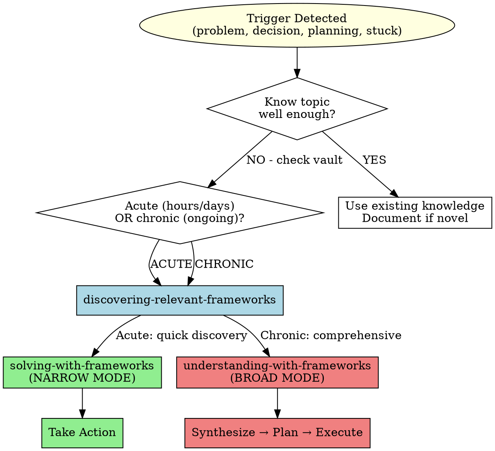

# Context-Aware Reasoning

## Overview

**Your vault contains 200+ mental models, 100+ books, 50+ people. Use this knowledge proactively.**

This skill orchestrates WHEN and HOW to leverage knowledge resources:
- **When** to check vault (automatic triggers)
- **Which** discovery mode (targeted vs comprehensive)
- **Which** application mode (solving vs understanding)
- **How** to integrate into current reasoning

**Core principle:** Don't reinvent frameworks already in vault. Query knowledge BEFORE solving problems.

## When to Use

### Automatic Triggers (ALWAYS check vault)

These phrases trigger automatic vault querying:

- ✅ "How should I approach X?"
- ✅ "What's the best way to Y?"
- ✅ "I'm stuck on Z"
- ✅ "Help me understand [topic]"
- ✅ Before creating implementation plan (>3 steps)
- ✅ Before making strategic decision
- ✅ Before designing system/architecture

**If you hear these, check vault. No exceptions.**

### Proactive Triggers (Consider checking)

Use judgment for these situations:

- Writing code for complex feature
- Debugging difficult issue
- Organizing information
- Making trade-off decisions
- Evaluating multiple approaches
- Entering unfamiliar domain

**Ask yourself: "Might there be frameworks for this in the vault?"**

## Decision Tree: Which Skills to Use



## Integration Workflow Patterns

### Pattern 1: Problem-Solving Integration

**Trigger:** User asks "How should I debug this API issue?"

**Orchestration:**

1. **Recognize trigger:** "How should I" → Check vault
2. **Assess mode:** API issue in production (acute) OR recurring pattern (chronic)?
   - If first time → Acute
   - If recurring → Chronic
3. **Query vault:** discovering-relevant-frameworks("debugging", "systematic", "root cause")
4. **Apply framework:**
   - Acute → solving-with-frameworks (find ONE debugging model, take action)
   - Chronic → understanding-with-frameworks (synthesize multiple perspectives)
5. **Integrate:** Use framework + technical debugging skills
6. **Execute:** Apply to API issue

**Output pattern:**
```markdown
Let me apply systematic debugging frameworks from the vault.

Found: [[Root Cause Tracing]] - trace from symptom back to trigger
Found: [[Defense in Depth]] - check all layers (not just obvious)

Applying Root Cause Tracing:
1. Symptom: Slow API responses (observable)
2. Immediate cause: Database queries (hypothesis)
3. Trace back: What changed? New feature? Load increase?
4. Root trigger: [investigation continues...]

[Rest of technical debugging integrated with framework...]
```

### Pattern 2: Strategic Planning Integration

**Trigger:** User asks "Help me plan a knowledge management system."

**Orchestration:**

1. **Recognize trigger:** Strategic planning → Check vault comprehensively
2. **Assess mode:** Strategic (not acute) → Broad mode
3. **Query vault:** discovering-relevant-frameworks("knowledge management", "organizational", "information", "second brain")
4. **Apply frameworks:** understanding-with-frameworks → Multi-perspective synthesis
5. **Integrate:** Plan incorporates multiple frameworks
6. **Execute:** Create implementation plan

**Output pattern:**
```markdown
This is strategic planning - let me comprehensively explore knowledge management frameworks.

**Discovery Results:**

**Mental Models** (5 found):
- [[PARA Method]] - Project/Area/Resource/Archive organization
- [[Getting Things Done]] - Capture, clarify, organize workflow
- [[Second Brain]] - Digital knowledge systems (this vault uses this!)
- [[Zettelkasten]] - Atomic notes with bidirectional links
- [[Progressive Summarization]] - Layered comprehension

**Books** (3 found):
- [[Building a Second Brain]] - Tiago Forte's comprehensive system
- [[Getting Things Done]] - David Allen's trusted system
- [[How to Take Smart Notes]] - Zettelkasten method

**Multi-Framework Synthesis:**

[Following understanding-with-frameworks skill]

PARA provides folder structure (proven in current vault). GTD provides capture workflow (inbox processing). Zettelkasten provides linking strategy (bidirectional connections enable emergence). Progressive Summarization provides compression (layered: highlights → summaries → remixes). Second Brain provides overall philosophy (extend cognition, not just storage).

**Tensions Identified:**
- PARA's hierarchical folders ↔ Zettelkasten's flat structure
- Resolution: Use PARA for organization, Zettelkasten for linking across hierarchy

**Recommended Approach (integrating all frameworks):**
1. Use PARA for folder structure (proven)
2. Apply GTD capture workflow (inbox → process)
3. Implement Zettelkasten linking (bidirectional)
4. Layer Progressive Summarization for important content
5. [etc...]
```

### Pattern 3: Code Design Integration

**Trigger:** User says "I need to implement user authentication."

**Orchestration:**

1. **Recognize:** Implementation task → Check vault + technical knowledge
2. **Assess:** Specific implementation (acute) BUT also architectural (strategic)
   - Dual nature: Quick action + strategic design
3. **Query vault:** discovering-relevant-frameworks("security", "systems", "defense")
4. **Also check:** Technical skills (may have auth patterns skill)
5. **Apply:** Mental models (high-level) + technical patterns (specific)
6. **Integrate:** Mental model guides architecture, technical guides implementation

**Output pattern:**
```markdown
Let me check vault for both strategic frameworks and technical patterns.

**Frameworks Found:**
- [[Defense in Depth]] - Multiple security layers
- [[Antifragile]] - Systems that benefit from attack attempts
- [[First Principles]] - Question security assumptions

**Integrated Approach:**

**High-level (mental models):**
- Defense in Depth: Multiple auth factors, don't rely on single mechanism
- Antifragile: Rate limiting + monitoring makes system stronger from attacks
- First Principles: Question assumption "passwords are sufficient"

**Architecture:**
1. Multiple layers (password + 2FA + session management) - Defense in Depth
2. Rate limiting (antifragile - learn from attack attempts) - Antifragile
3. Monitoring/alerting (benefit from exposure) - Antifragile
4. Challenge "what auth do we ACTUALLY need?" - First Principles

**Technical Implementation:**
[Specific code patterns for auth...]

[Framework-guided technical implementation continues...]
```

## Mode Selection Guide

| Situation | Acute or Chronic? | Discovery Mode | Application Mode | Skill Used |
|-----------|------------------|----------------|------------------|-----------|
| Missed deadline | Acute | Quick (MoC only) | Narrow (1 framework) | solving-with-frameworks |
| Team underperforms (ongoing) | Chronic | Comprehensive (all 4 entry points) | Broad (3-5 frameworks) | understanding-with-frameworks |
| API bug in production | Acute | Quick | Narrow | solving-with-frameworks |
| Designing architecture | Chronic/Strategic | Comprehensive | Broad | understanding-with-frameworks |
| "How do I handle this conflict?" | Acute | Quick | Narrow | solving-with-frameworks |
| "How do I improve our culture?" | Chronic | Comprehensive | Broad | understanding-with-frameworks |
| Specific code review comment | Acute | Quick | Narrow | solving-with-frameworks |
| Career direction decision | Chronic/Strategic | Comprehensive | Broad | understanding-with-frameworks |

## Orchestration Workflow

**IMPORTANT: Use TodoWrite for multi-step orchestrations**

### Quick Orchestration (Acute Problems) - 5-7 minutes total

- [ ] **Trigger recognition** (instant)
  - Detected: "How should I..." or similar

- [ ] **Mode assessment** (10 seconds)
  - Acute or chronic?
  - Time pressure?
  - Single action OR understanding needed?

- [ ] **Vault query** (3 min)
  - Use discovering-relevant-frameworks (quick mode)
  - MoC scan only for acute

- [ ] **Framework application** (3 min)
  - Use solving-with-frameworks (narrow mode)
  - ONE framework, quick action

- [ ] **Integration** (1 min)
  - Apply framework to specific problem
  - Show HOW framework guides solution

- [ ] **Execution**
  - Take action informed by framework

### Comprehensive Orchestration (Strategic Problems) - 20-25 minutes total

- [ ] **Trigger recognition** (instant)
  - Detected: Strategic planning, chronic issue

- [ ] **Mode assessment** (30 seconds)
  - Confirmed: Chronic, multi-dimensional, no time pressure

- [ ] **Vault query** (5 min)
  - Use discovering-relevant-frameworks (comprehensive mode)
  - All 4 entry points (MoC, Books, People, Cross-ref)

- [ ] **Framework application** (18 min)
  - Use understanding-with-frameworks (broad mode)
  - 3-5 diverse frameworks, synthesis, tensions

- [ ] **Integration** (2 min)
  - Multi-framework synthesis specific to their situation
  - Show what EACH framework reveals
  - Navigate tensions explicitly

- [ ] **Planning**
  - Create implementation plan incorporating synthesis

## Common Mistakes

| Mistake | Impact | Fix |
|---------|--------|-----|
| **Didn't check vault** | Reinvented existing frameworks | Automatic triggers - ALWAYS check on "how should I..." |
| **Picked wrong mode** | Too shallow or overthinking | Use decision tree - acute vs chronic |
| **Only mentioned frameworks** | User doesn't see integration | Show HOW framework applies to specific situation |
| **Checked vault for trivial problems** | Overhead without benefit | Use judgment - worth framework application? |
| **Used knowledge but didn't cite** | Lost transparency, learning opportunity | Always cite: "Found [[Framework]] in vault, applying..." |
| **Generic application** | Framework not adapted to context | Make it specific to their exact situation |

## Red Flags - Check Vault

If you're about to:
- Explain "best practice" without checking if researched in vault
- Design system without consulting frameworks
- Debug without systematic approach
- Make recommendation without framework basis
- Create plan without strategic models
- Give generic advice when specific frameworks exist

**All mean: Query vault first.**

## Success Criteria

You're using context-aware reasoning when:

- ✅ Automatically query vault on trigger phrases (no reminder needed)
- ✅ Select appropriate mode (solving vs understanding)
- ✅ Explicitly cite frameworks applied ("Found [[X]] in vault...")
- ✅ Integrate knowledge into specific context (not just mention)
- ✅ User sees HOW framework applies to THEIR situation
- ✅ Transparent about what was found and why it's relevant

## Test Scenarios

### Baseline (RED) - Without this skill

**Scenario:** User asks "How should I improve team performance?"

**Agent behavior without skill:**
- Gives generic advice without checking vault
- Misses: Extreme Ownership, AQAL, Radical Transparency, Teal Organizations all in vault
- Reinvents frameworks already researched
- User doesn't know vault knowledge exists
- No citation of sources

**Failure modes:**
1. Vault knowledge not leveraged
2. Reinvented existing frameworks
3. Generic advice (not framework-grounded)
4. Lost opportunity for user to learn vault contents

### With Skill (GREEN) - Acute Problem

**Scenario:** User asks "How should I improve team performance?"

**Orchestration:**

- ✅ Trigger detected: "How should I..." → Check vault automatically
- ✅ Assess: Could be acute OR chronic (ask clarification if unclear)
- ✅ Assume acute for initial response, offer deeper analysis

**Quick Response (assuming acute - specific action needed):**

```markdown
Let me check the vault for team performance frameworks.

**Quick Discovery (MoC scan - 60s):**

Found in Leadership section:
- [[Extreme Ownership]] - Leader accountability for all outcomes
- [[Prioritize and Execute]] - Focus on highest priority
- [[Circle of Influence]] - Control what you can control

**Applying Extreme Ownership (narrow mode - 3 min):**

Core principle: Take complete ownership of team outcomes, no blame.

**Specific to YOUR situation:**
1. Identify what you own about team performance (even if "not your fault")
2. Ask: "What could I have done differently to set team up for success?"
3. Action: Take responsibility to team (builds trust) + stakeholders (builds credibility)

**Next step:** Schedule team retrospective where you model ownership.

---

**Note:** This is narrow mode (quick action). If team underperformance is chronic/ongoing pattern, I can provide comprehensive multi-framework analysis using understanding-with-frameworks. Would you like deep analysis?
```

### With Skill (GREEN) - Strategic Problem

**Scenario:** User clarifies "Team has been underperforming for months, need to understand why and fix systemically."

**Orchestration:**

- ✅ Trigger: Chronic issue, strategic understanding needed
- ✅ Mode: Broad (understanding-with-frameworks)
- ✅ Query: Comprehensive (all 4 entry points)

**Comprehensive Response:**

```markdown
This is a chronic systemic issue - let me explore comprehensively.

**Comprehensive Discovery (5 min):**

**Mental Models** (4 found):
- [[Extreme Ownership]] - Leader accountability
- [[AQAL Four Quadrants]] - Individual/collective, interior/exterior
- [[Radical Transparency]] - Truth-seeking culture
- [[Reinventing Organizations]] - Organizational evolution (Teal)

**Books** (3 found):
- [[Extreme Ownership]] by [[Jocko Willink]]
- [[Principles]] by [[Ray Dalio]]
- [[Reinventing Organizations]] by [[Frédéric Laloux]]

**Multi-Framework Synthesis (18 min comprehensive analysis):**

[Following understanding-with-frameworks skill]

**AQAL reveals** this isn't just one dimension:
- I (individual): Are people motivated? Skills matched to work?
- It (individual metrics): Are goals clear? Feedback timely?
- We (culture): Is trust high? Psychological safety?
- Its (systems): Are processes helping or hindering?

**Extreme Ownership reveals**: As leader, I own ALL outcomes. Questions:
- How did my decisions contribute to this?
- What did I fail to communicate clearly?
- Where did I not empower the team?

**Radical Transparency suggests**: Are we truth-seeking or political?
- Can people speak up without fear?
- Are decisions based on best ideas or hierarchy?

**Teal Organizations suggests**: Is structure appropriate for complexity?
- Too much hierarchy for the work?
- Lack of autonomy demotivating?

**Key Tensions:**
- Ownership (leader accountability) ↔ Empowerment (team autonomy)
  - Balance: Own outcomes but empower decision-making

**Convergent Insight:** ALL frameworks point to transparency and trust

**Recommended Multi-Framework Approach:**
1. AQAL: Assess all 4 quadrants (not just systems/structure)
2. Extreme Ownership: Take responsibility in team meeting (models trust)
3. Radical Transparency: Create safe space for honest feedback
4. Teal: Consider empowerment level - do they have autonomy?

**Next Steps:**
1. Run AQAL diagnostic across all quadrants
2. Schedule team retrospective (take ownership, invite truth)
3. Assess: Are they empowered to make decisions?
```

**Total time: 23 minutes comprehensive analysis**

**Success indicators:**
1. Appropriate mode selection (chronic → broad)
2. Comprehensive discovery (4 entry points)
3. Multi-framework synthesis (4 perspectives)
4. Specific to their situation (not generic)
5. Explicit citations ("AQAL reveals...", "Dalio suggests...")
6. Actionable next steps informed by frameworks

### Refactor (Close Loopholes)

**New rationalizations discovered during testing:**

| Rationalization | Counter Added to Skill |
|-----------------|------------------------|
| "Seemed like simple question, didn't need vault" | "How should I" = AUTOMATIC trigger, no exceptions" |
| "Didn't want to waste time searching" | "Checking vault takes <5 min, saves hours of reinvention" |
| "I know this topic already" | "Vault may have research you haven't seen. Always check." |
| "Used knowledge but didn't cite" | "ALWAYS explicit: 'Found [[X]] in vault, applying...'" |
| "Framework didn't quite fit" | "Adapt framework to context, show HOW you adapted" |

## Integration with Other Skills

**Orchestrates (calls in sequence):**
1. skills/knowledge-resources/discovering-relevant-frameworks - Find frameworks
2. skills/knowledge-resources/solving-with-frameworks - Narrow mode (OR)
3. skills/knowledge-resources/understanding-with-frameworks - Broad mode

**Integrates with:**
- skills/collaboration/brainstorming - Framework-informed ideation
- skills/debugging/systematic-debugging - Mental models + technical debugging
- skills/testing/test-driven-development - Framework-guided development

**This is the ENTRY POINT that makes the whole knowledge system proactive.**

## Remember

**Your vault contains 200+ mental models, 100+ books, 50+ thought leaders.**

**This knowledge is your competitive advantage. Use it proactively.**

Trigger recognition → Mode selection → Discovery → Application → Integration → Citation

Make vault knowledge visible and actionable in every recommendation.
