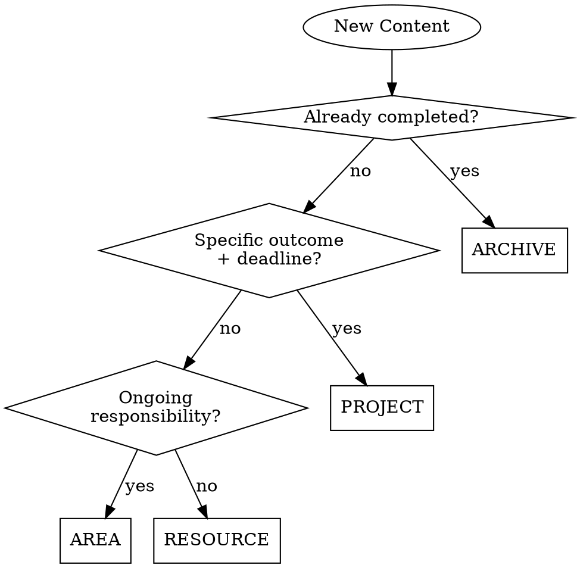

# Creating Obsidian Notes

## Overview

**Search before create. Link before save. Verify before finish.**

Creating notes without searching first causes:
- Duplicate content across the vault
- Orphan notes (no connections)
- Wrong PARA placement
- Missed opportunities to enhance existing notes

**Core principle:** The best new note is often an enhancement to an existing one.

## The Iron Law

```
NO NOTE CREATION WITHOUT SEARCH FIRST
```

If you write a note before searching the vault, delete it and start over.

**No exceptions:**
- Not for "quick captures"
- Not for "obviously new topics"
- Not when "in a hurry"

## When to Use

**Always use this skill when:**
- User asks you to "create a note about X"
- You're about to use Write tool in Obsidian vault
- Processing inbox items into PARA folders
- Capturing new information or ideas

**Especially when:**
- Topic seems related to existing content
- Creating in an established AREA (health, family, finance)
- User has been working in this domain before

## Note Creation Workflow

**IMPORTANT: Use TodoWrite to create todos for this checklist.**

### Phase 1: Discovery (MANDATORY)

**Never skip. Not even for "simple" notes.**

- [ ] **Search for existing notes on topic**
  ```bash
  # Content search (case-insensitive)
  Grep pattern: "topic-keyword" -i
  path: /path/to/vault

  # Wikilink search
  Grep pattern: \[\[.*topic.*\]\] -i

  # Tag search
  Grep pattern: #topic-tag

  # File name search
  Glob pattern: **/*topic*.md
  ```

- [ ] **Check target PARA location exists and read existing structure**
  ```bash
  # If creating in Area, read existing notes
  Glob pattern: *.md
  path: 02-AREAS/Target-Area/

  # Read 2-3 most relevant existing notes
  Read: [identified files]
  ```

- [ ] **Decision point: Create new vs enhance existing?**
  - Found very similar note (>70% overlap)? → **STOP. Enhance existing instead**
  - Found related notes? → **Continue, but link to them (minimum 3)**
  - Found nothing? → **Continue, create new**

### Phase 2: PARA Classification

Use skills/obsidian/para-classification-decisions for ambiguous cases.

**Quick classification:**


- [ ] **Classify content into PARA category**
- [ ] **For AREA: Verify Area name matches existing structure**
  - Private vault: Gezin, Gezondheid, Holdings en BVs, Knowledge Management, Persoonlijke Ontwikkeling, Prive Financien
  - POA vault: MT, Beleid, Governance, etc.

### Phase 3: Template Selection

- [ ] **Select appropriate template**
  - PROJECT → `05-TEMPLATES/Project.md`
  - AREA → `05-TEMPLATES/Area Overview.md`
  - Daily note → `05-TEMPLATES/Daily Note.md`
  - Inbox capture → `05-TEMPLATES/Inbox Capture.md`

- [ ] **Read template completely to understand required fields**
  ```bash
  Read: /path/to/template.md
  ```

### Phase 4: Content Creation

- [ ] **Create YAML frontmatter with required fields**
  ```yaml
  ---
  type: project|area|resource|daily
  status: active|planning|archived
  created: {{date:YYYY-MM-DD}}
  tags: [tag1, tag2, tag3]
  # PROJECT-specific:
  deadline: YYYY-MM-DD
  priority: high|medium|low
  # AREA-specific:
  area: "[[Parent Area]]"
  ---
  ```

- [ ] **Follow template structure (don't skip sections)**

- [ ] **Use clear, descriptive heading**
  - Include emoji from template
  - Use user's preferred language (Dutch for private, English for work)

### Phase 5: Linking (MINIMUM 3 LINKS)

**This is NOT optional. Orphan notes = failed note creation.**

- [ ] **Add minimum 3 outgoing links to:**
  1. **Parent/related Area** (e.g., `[[Gezondheid]]` for health notes)
  2. **Related Project or existing notes** (from Phase 1 discovery)
  3. **Hub/MOC note** if exists (e.g., `[[Python MOC]]`)

- [ ] **Verify all linked notes exist**
  ```bash
  # Check if note exists
  Glob pattern: **/Note Name.md
  # If doesn't exist → don't link or create stub
  ```

- [ ] **Add context to links (not just bare links)**
  ```markdown
  # ❌ Bad
  Related: [[Health]], [[Fitness]], [[Nutrition]]

  # ✅ Good
  This project supports the [[Gezondheid|Health]] area's goal of
  maintaining consistent [[Crossfit]] training 3x/week.
  See [[Whoop Data]] for recovery tracking integration.
  ```

### Phase 6: Placement & Verification

- [ ] **Construct correct file path**
  ```
  01-Private/01-PROJECTS/[Project Name].md
  01-Private/02-AREAS/[Area Name]/[Note Name].md
  02-POA/01-PROJECTS/[Project Name]/[Note Name].md
  ```

- [ ] **Verify parent directory exists before Write**
  ```bash
  ls -la "/path/to/parent/directory"
  ```

- [ ] **Use Write tool with absolute path**

- [ ] **Verify file was created successfully**
  ```bash
  ls "/full/path/to/new/note.md"
  ```

### Phase 7: Dashboard Updates (if applicable)

- [ ] **If created PROJECT: Check if main Dashboard needs update**
- [ ] **If created in AREA: Check if Area dashboard exists and update**
- [ ] **If created daily note: No dashboard update needed**

## Common Mistakes

| Mistake | What Happens | Fix |
|---------|-------------|-----|
| **No search first** | Created duplicate of existing Python note when 9 Python notes existed | Always Phase 1 discovery, no exceptions |
| **Jumped straight to Write** | Missed opportunity to enhance existing health area that already had structure | Read target location first, Phase 1 mandatory |
| **Limited linking (only 1-2)** | Orphan note, can't discover via graph | Minimum 3 links, Phase 5 non-negotiable |
| **Didn't verify links exist** | Broken links to non-existent notes | Phase 5: Glob check each linked note |
| **Created in existing Area without reading** | Duplicate structure, missed existing subfolders | Phase 1: Read 2-3 existing notes in target Area |
| **Skipped template** | Inconsistent metadata, missing sections | Phase 3: Always use template |
| **Wrong PARA classification** | "Health maintenance" in PROJECTS (should be AREA) | Phase 2: Use flowchart, check if has deadline |

## Red Flags - STOP and Follow Workflow

If you catch yourself thinking:
- "I'll just create it quickly and add links later" → **NO. Links now or don't create**
- "Obviously this is new, no need to search" → **NO. Always search, found 9 Python notes when assumed 0**
- "I'll skip the template this time" → **NO. Templates prevent missing metadata**
- "I know this should be a Project" → **NO. Use flowchart, health was misclassified**
- "Searching will take too long" → **NO. Searching takes 30 seconds, cleaning up duplicates takes 30 minutes**
- "Just drop it in INBOX for now" → **NO. Classify and place correctly now**

**ALL of these mean: STOP. Follow Phase 1-7 workflow.**

## Quick Reference

### Minimum Requirements Checklist

Every new note MUST have:
- [ ] ✅ Searched vault first (Phase 1)
- [ ] ✅ Correct PARA placement (Phase 2)
- [ ] ✅ Template-based structure (Phase 3)
- [ ] ✅ YAML frontmatter (Phase 4)
- [ ] ✅ Minimum 3 outgoing links (Phase 5)
- [ ] ✅ Links verified to exist (Phase 5)
- [ ] ✅ Absolute path file creation (Phase 6)

Can't check all boxes? Don't create the note yet.

## Search Patterns Reference

| Goal | Tool | Pattern |
|------|------|---------|
| Find mentions | Grep | `topic-keyword` with `-i` flag |
| Find wikilinks | Grep | `\[\[.*topic.*\]\]` |
| Find tags | Grep | `#tag-name` |
| Find files | Glob | `**/*topic*.md` |
| Check exists | Bash | `ls "/path/to/note.md"` |
| Read area | Glob + Read | `*.md` in target folder |

## Integration with Other Skills

This skill calls:
- skills/obsidian/para-classification-decisions - When classification ambiguous (Phase 2)
- skills/obsidian/discovering-vault-knowledge - For comprehensive search (Phase 1)
- skills/obsidian/obsidian-linking-strategy - For linking decisions (Phase 5)

## Success Criteria

You know you followed this skill correctly when:
- Found and enhanced existing note instead of creating duplicate (discovery worked)
- New note has 3+ meaningful links (no orphans)
- Correct PARA placement (classification worked)
- Template structure followed (consistency)
- All linked notes actually exist (verification worked)

## Workflow Time Investment

- Phase 1 (Discovery): 30-60 seconds
- Phase 2 (Classification): 10-20 seconds
- Phase 3 (Template): 10 seconds
- Phase 4 (Content): 2-5 minutes (varies by note type)
- Phase 5 (Linking): 30-60 seconds
- Phase 6 (Placement): 10 seconds
- Phase 7 (Dashboard): 20-30 seconds

**Total overhead: 2-4 minutes**
**Time saved avoiding duplicates/orphans: 30+ minutes**

The workflow is NOT overhead - it's investment that pays 10x returns.

## Remember

**The best new note is often not a new note at all - it's an enhancement to an existing one.**

Search first. Always.
