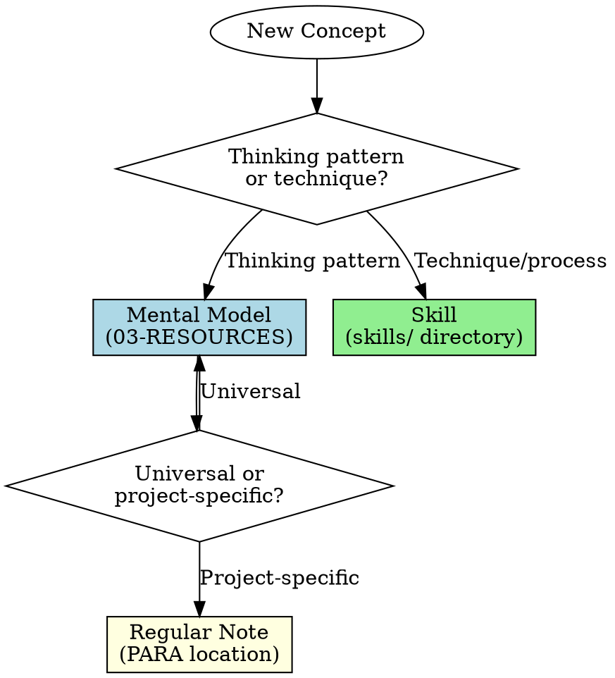

# Maintaining Mental Model Notes

## Overview

**Mental models are CONTENT (thinking patterns), not PROCESS (techniques).**

This skill prevents:
- Creating skills for mental models (wrong layer)
- Inconsistent model documentation
- Missing critical sections (limitations!)
- Poor discoverability in vault
- Saving to flat root instead of domain folders
- Missing taxonomy metadata dimensions

**Core principle:** Mental models belong in `01-Private/03-RESOURCES/Mental Models/[DOMAIN]/`, not skills/. Document WHAT the model is, not HOW to apply it (that's other skills).

**v2.0 Taxonomy System:**
- **10 domain folders** for primary organization (Philosophy, Psychology, Productivity, etc.)
- **5 metadata dimensions** for multi-dimensional querying (level, scope, cognitive-type, tradition, complexity)
- Enables finding models by application level (individual vs organizational), time horizon (tactical vs strategic), thinking type, cultural origin, and learning curve

## When to Use

**Create mental model note when:**
- Book introduces framework for thinking (AQAL, First Principles, Extreme Ownership)
- Found pattern that explains reality (Antifragile, Circle of Influence)
- Discovered decision framework (5-Step Process, Prioritize and Execute)

**Don't create when:**
- It's a technique/process → Create skill instead (TDD, systematic debugging)
- It's project/domain-specific → Create regular note
- It's already captured in book note → Extract if worthy of standalone reference

**Decision flowchart:**



## Required Structure

### Frontmatter Template

```yaml
---
type: mental-model
category: [primary-domain] # Determines folder placement - see domain mapping below
creator: [Person Name]
year: [YYYY when created/published]
source: "[[Book Title]]" or "Multiple sources"
status: active
created: YYYY-MM-DD

# TAXONOMY DIMENSIONS (for multi-dimensional querying):
level: [individual, interpersonal, organizational, societal] # Who uses this?
scope: tactical/strategic/philosophical # Time horizon
cognitive-type: analytical/behavioral/perceptual/integrative # How it works
tradition: eastern-philosophy/western-business/classical-philosophy/modern-science/etc.
complexity: foundational/intermediate/advanced # Learning curve

tags: [mental-models, specific-domain-tags, creator-name]
---
```

**Domain Folder Mapping (category → folder):**
- philosophy, spirituality → `01-Philosophy-Spirituality/`
- psychology, wellbeing → `02-Psychology-Wellbeing/`
- productivity, learning, personal-development → `03-Productivity-Learning/`
- leadership, management, communication → `04-Leadership-Management/`
- business, strategy, innovation → `05-Business-Strategy/`
- finance, economics, investing → `06-Finance-Economics/`
- decision-making, problem-solving, critical-thinking → `07-Decision-Making-Reasoning/`
- systems-thinking, complexity → `08-Systems-Complexity/`
- technology, futurism, AI → `09-Technology-Future/`
- health, fitness, performance → `10-Health-Performance/`

### Content Sections (All Required)

**1. Overview** (2-3 sentences)
- Core principle in plain language
- What is this mental model?
- Why does it matter?

**2. Core Principles** (Bullet list)
- Fundamental components of the model
- 3-7 key principles
- These are the "building blocks"

**3. Key Applications** (When/where to use)
- "Use this when:" section with specific triggers
- "Especially helpful for:" domain examples
- Concrete situations where this applies

**4. Strengths** (5-7 bullets)
- Why this model is powerful
- What insights it provides
- Where it excels
- **Be specific, not generic praise**

**5. Limitations** (5-7 bullets - CRITICAL SECTION)
- Weaknesses and blind spots
- When NOT to use
- What it misses or oversimplifies
- Risks of misapplication
- **Equal rigor to strengths - this is NOT optional**

**6. Examples** (3 real-world applications)
- From DIFFERENT domains
- Concrete, specific scenarios
- Show how to apply the model
- Format: Problem → Model application → Insight

**7. Related Mental Models** (Wikilinks)
- 3-5 related frameworks
- Brief note on relationship (complementary, contrasting, etc.)
- Link to [[MoC Mental Models]]

**8. Resources & Further Reading**
- Source [[Books]] where this appears
- Articles, papers, talks
- Original sources if applicable

**9. Classification**
- Parent Area: [[Mental Models]]
- Category: [specific domain]
- Complexity: Low/Medium/High
- Universality: Domain-specific or Universal

## Workflow Checklist

**IMPORTANT: Use TodoWrite for this checklist when creating mental model note**

### Phase 1: Verification

- [ ] **Search vault for existing note**
  ```bash
  # Check if already exists in Mental Models (all domain folders)
  Grep pattern: "model-name" -i
  path: 01-Private/03-RESOURCES/Mental Models/

  # Check in books
  Grep pattern: "model-name" -i
  path: 01-Private/03-RESOURCES/Books/
  ```

- [ ] **Decision: Is this really a mental model?**
  - ✅ Thinking pattern/framework → Mental model
  - ❌ Process/technique → Create skill instead
  - ❌ Already in book note → Only extract if worthy of standalone

### Phase 2: Research

- [ ] **Research the model comprehensively**
  - Web search: "[Model name] mental model"
  - Academic sources if applicable
  - Multiple perspectives (proponents AND critics)
  - Original source (book, paper, person who created it)

- [ ] **Verify creator attribution**
  - Who created or popularized this?
  - Check if [[Influential People]] note exists
  - If not, may need to create person note

### Phase 3: Content Creation

- [ ] **Create proper frontmatter** (use template above)

- [ ] **Write all 9 required sections**
  - Don't skip any section
  - Limitations section with equal rigor to strengths
  - 3 examples from different domains

- [ ] **Critical quality checks:**
  - [ ] Limitations section has 5+ specific items (not vague)
  - [ ] Examples are concrete (not generic)
  - [ ] Links to source [[Book]] and [[Creator]]
  - [ ] Added to [[MoC Mental Models]]

### Phase 4: Integration

- [ ] **Link to knowledge graph**
  - Link to [[MoC Mental Models]]
  - Link to [[Creator Name]] in Influential People
  - Link to source [[Book Title]]
  - Link to 3-5 related mental models

- [ ] **Update MoC Mental Models**
  - Add to featured section if significant
  - Add to comprehensive table
  - Update count statistics

- [ ] **Cross-reference from book note**
  - Update source book to link to this model
  - Add to "mental models extracted" section

## Common Mistakes

| Mistake | Impact | Fix |
|---------|--------|-----|
| **Created skill instead of note** | Wrong layer, unmaintainable | Mental model = CONTENT (vault), Skill = PROCESS (skills/) |
| **Skipped limitations section** | Uncritical hero worship | 5+ specific limitations with equal weight to strengths |
| **Vague limitations** | "Some disagree" or "Not always applicable" | Specific: "Requires 18-month adaptation, not all personalities suit" |
| **Only 1-2 examples** | Can't see application pattern | 3 examples from DIFFERENT domains (business, personal, technical) |
| **No source attribution** | Can't trace lineage | Always link to [[Book]] and [[Creator]] |
| **Generic examples** | Not actionable | Use real scenarios: "SpaceX rocket cost" not "engineering problem" |
| **Didn't update MoC** | Orphan note, poor discovery | Always add to [[MoC Mental Models]] |
| **Created before searching** | Duplicate content | Always search first (grep mental models + books) |

## Example: Complete Mental Model Note

**File:** `01-Private/03-RESOURCES/Mental Models/07-Decision-Making-Reasoning/First Principles Thinking.md`

```markdown
---
type: mental-model
category: decision-making
creator: Elon Musk (popularized; originated with Aristotle)
year: 2001
source: "[[Elon Musk]] by Walter Isaacson"
status: active
created: 2025-10-21

# TAXONOMY DIMENSIONS:
level: [individual, organizational]
scope: strategic
cognitive-type: analytical
tradition: [classical-philosophy, modern-science]
complexity: intermediate

tags:
  - mental-models
  - problem-solving
  - innovation
  - reasoning
  - musk
---

# 🧠 First Principles Thinking

## Overview

First Principles Thinking is a problem-solving approach that involves breaking down complex problems into their most basic, foundational truths and reasoning up from there, rather than reasoning by analogy or convention.

## Core Principles

- **Identify and question assumptions**: Challenge every belief
- **Break down to fundamentals**: Reduce to basic, provable truths
- **Rebuild from the ground up**: Construct new solutions
- **Reason, don't analogize**: Build from physics and logic

## Key Applications

**Use this when:**
- Existing solutions seem inadequate or too expensive
- Entering new domain needing breakthrough innovation
- Conventional wisdom produces unsatisfying results

## Strengths

- Enables breakthrough innovation others miss
- Often reveals expensive assumptions that can be eliminated
- Forces genuine comprehension vs surface mimicry
- Transferable across any domain
- Creates competitive advantage (most people reason by analogy)

## Limitations

- Time-intensive, requires significant mental effort
- Requires domain knowledge to identify true fundamentals
- Can miss useful patterns (sometimes analogy is efficient)
- Risk of reinventing the wheel
- Social resistance to challenging conventions

## Examples

[3 examples from different domains as shown in plan...]

## Related Mental Models

- [[Socratic Method]] - Questioning to reach fundamental truths
- [[Occam's Razor]] - Simplest explanation often correct
- [[Inversion]] - Thinking backwards from desired outcome
- [[MoC Mental Models]] - Return to overview

## Resources & Further Reading

- [[Elon Musk]] - Walter Isaacson
- "The Cook and the Chef: Musk's Secret Sauce" - Wait But Why (Tim Urban)
- [[Zero to One]] - Peter Thiel

## Classification

**Parent Area:** [[Mental Models]]
**Category:** Problem Solving & Innovation
**Complexity:** Medium
**Universality:** Universal
```

## Red Flags - STOP and Reconsider

If you're about to:
- Create "first-principles-thinking" skill → STOP. It's a mental model (content), not process
- Skip limitations section → STOP. This is critical for balanced analysis
- Write "Some disagree with this approach" → STOP. Be specific about limitations
- Create note without searching first → STOP. Check for duplicates
- Put in skills/ directory → STOP. Mental models go in 01-Private/03-RESOURCES/Mental Models/[DOMAIN]/
- Save to flat root directory → STOP. Use domain folders (01-Philosophy-Spirituality/, etc.)
- Skip new metadata dimensions → STOP. All 5 taxonomy fields required (level, scope, cognitive-type, tradition, complexity)
- Only positive framing → STOP. Critical analysis requires strengths AND weaknesses

**All mean: Review this skill before proceeding**

## Test Scenarios

### Baseline (RED) - Without this skill

**Scenario:** Extract "First Principles Thinking" from Elon Musk biography

**Agent behavior without skill:**
- Creates skill file: `skills/problem-solving/first-principles-thinking/SKILL.md`
- Frontmatter incomplete (missing creator, year, source)
- Limitations section: "Not always applicable" (vague)
- Only 2 examples (both from SpaceX - same domain)
- Doesn't link to [[Elon Musk]] person note
- Doesn't update [[MoC Mental Models]]
- Creates in wrong location (skills/ instead of vault)

**Failure modes:**
1. Layer confusion (skill vs mental model)
2. Incomplete documentation
3. Uncritical analysis (weak limitations)
4. Poor integration (missing links)

### With Skill (GREEN)

**Same scenario with this skill loaded:**

- [ ] Searches first: `Grep "first principles" in Mental Models/` (searches all domain folders)
- [ ] Recognizes: This is thinking pattern → mental model (not skill)
- [ ] Determines category: decision-making/problem-solving → `07-Decision-Making-Reasoning/`
- [ ] Creates note: `01-Private/03-RESOURCES/Mental Models/07-Decision-Making-Reasoning/First Principles Thinking.md`
- [ ] Complete frontmatter with ALL metadata:
  - Basic: type, category, creator, year, source, tags
  - Taxonomy: level=[individual, organizational], scope=strategic, cognitive-type=analytical, tradition=[classical-philosophy, modern-science], complexity=intermediate
- [ ] Limitations section: 5 specific items ("Time-intensive", "Requires domain knowledge", "Can miss useful patterns", etc.)
- [ ] Examples: 3 from different domains (SpaceX rockets, battery cost, personal learning)
- [ ] Links to: [[Elon Musk]], [[Elon Musk]] book, [[MoC Mental Models]]
- [ ] Updates [[MoC Mental Models]] comprehensive table
- [ ] Cross-references from [[Elon Musk]] book note

**Success indicators:**
1. Correct layer (vault note, not skill)
2. Correct location (domain folder, not flat root)
3. Complete metadata (all 5 taxonomy dimensions)
4. Complete structure (all 9 sections)
5. Critical analysis (specific limitations)
6. Rich integration (multiple links)

### Refactor (Close Loopholes)

**New rationalizations discovered during testing:**

| Rationalization | Counter Added to Skill |
|-----------------|------------------------|
| "Limitations are obvious, can skip" | "Limitations section NOT optional - 5+ specific items required" |
| "This is both model and technique" | "Choose primary type: Thinking pattern → Model, Process → Skill" |
| "Source is common knowledge, no need to cite" | "ALWAYS attribute: link to specific book and person" |
| "One good example is enough" | "3 examples from DIFFERENT domains - shows universality" |
| "I'll add to MoC later" | "Integration checklist: Update MoC before marking complete" |

## Success Criteria

You followed this skill correctly when:

- ✅ Created note in correct domain folder (01-Private/03-RESOURCES/Mental Models/[DOMAIN]/)
- ✅ Complete frontmatter with all 5 taxonomy dimensions (level, scope, cognitive-type, tradition, complexity)
- ✅ All 9 content sections present with complete content
- ✅ Limitations section has 5+ specific, critical items
- ✅ 3 examples from different domains
- ✅ Linked to creator, source book, MoC, related models
- ✅ Updated [[MoC Mental Models]] table
- ✅ Did NOT create skill in skills/ directory
- ✅ Did NOT save to flat root directory

## Integration with Other Skills

**Calls:**
- skills/obsidian/creating-obsidian-notes - For note creation workflow
- skills/obsidian/discovering-vault-knowledge - For duplicate checking

**Called by:**
- skills/knowledge-resources/maintaining-book-notes - When extracting models
- skills/knowledge-resources/context-aware-reasoning - When documenting frameworks used

## Remember

**Mental models are thinking patterns (CONTENT), not processes (SKILLS).**

Document WHAT the model is. Other skills teach HOW to find and apply it.
