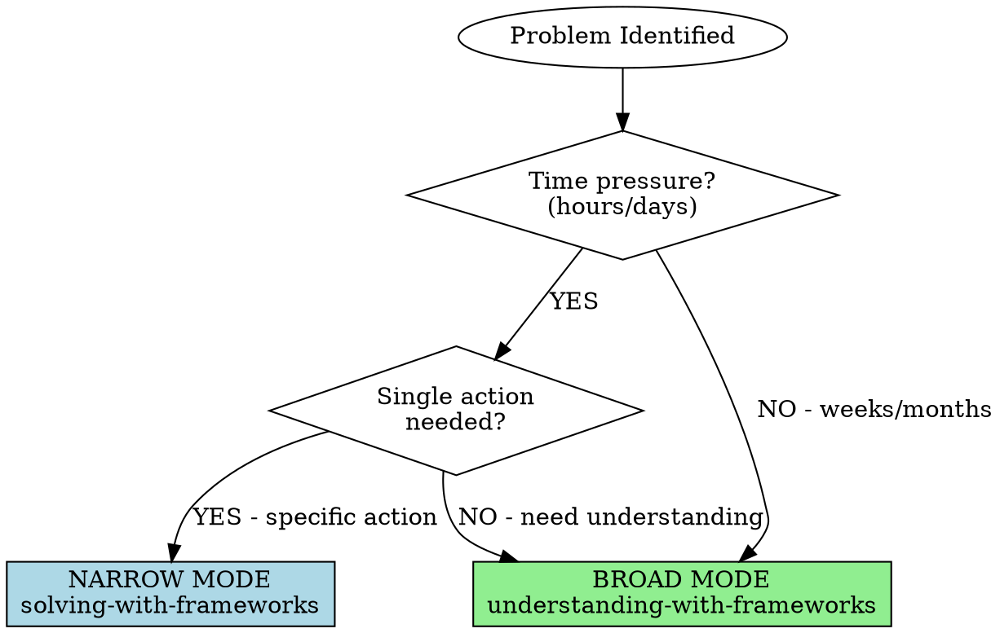

# Solving with Frameworks

## Overview

**NARROW MODE: Fast action on specific problems.**

**Time investment:** 3-6 minutes total (3-5 min to action + 30-60s logging)
**Context saved:** Optional ~10-20k tokens if subagent used for complex search
**Goal:** Find THE right framework, apply it, take action, log result
**Use for:** Acute problems, tactical decisions, "what do I do right now?"

**NOT for:** Strategic planning, chronic issues, deep understanding (use understanding-with-frameworks instead)

**Core principle:** Speed over comprehensiveness. Good enough framework applied quickly beats perfect framework applied late.

## When to Use vs When NOT to Use



### Use This Skill When (NARROW):

**Acute problems:**
- Team missed deadline (what do I do?)
- Conflict with colleague (how do I handle?)
- Decision needed today (what framework applies?)
- Stuck on specific bug (what mental model helps?)
- Client upset (how do I respond?)

**Characteristics:**
- ✅ Time pressure (hours/days not weeks)
- ✅ Specific incident (not systemic pattern)
- ✅ Action needed (not analysis)
- ✅ Single dimension (not multi-faceted)
- ✅ "What do I DO?" (not "How does this work?")

### Use understanding-with-frameworks Instead When (BROAD):

**Chronic/strategic:**
- Organization struggling with innovation (systemic)
- Team consistently underperforming (pattern)
- Career direction decision (multi-dimensional)
- Designing new system (strategic)
- "Help me understand this deeply" (insight not action)

**Characteristics:**
- ❌ No time pressure (days/weeks available)
- ❌ Ongoing pattern (chronic issue)
- ❌ Multi-dimensional (culture + structure + people + systems)
- ❌ Understanding needed before action
- ❌ "How does this work?" (not "What do I do?")

## Fast Application Process

**IMPORTANT: Use TodoWrite for this checklist**

### Phase 1: Problem Distillation (30 seconds)

- [ ] **State problem in ONE sentence**
  - Be specific: "Team missed Q4 deadline on Dashboard project"
  - NOT vague: "Team has problems"
  - Include: Who, what, when (not why yet - framework will reveal)

- [ ] **Identify domain** (leadership, decision-making, productivity, systems, etc.)
  - Usually obvious from problem statement
  - Pick primary domain (don't overthink)

- [ ] **Extract 2-3 keywords** for search
  - Example: "deadline" + "accountability" + "leadership"
  - Keep simple - for quick grep if needed

**Time check: 30 seconds. If longer, you're overthinking.**

### Phase 2: Targeted Discovery (60-90 seconds)

- [ ] **Quick MoC scan** (in main conversation - only 60s)
  ```bash
  Read: 03-RESOURCES/Mental Models/MoC Mental Models.md
  # Scan ONLY relevant domain section (Leadership, Psychology, etc.)
  # Don't read whole MoC - targeted scan
  ```

- [ ] **Identify 1-2 candidate frameworks**
  - Look for exact match to problem type
  - Check "When to Use" section in table
  - Pick most applicable

- [ ] **Fallback if no obvious match:**

  **OPTION A - Fast grep (30s, recommended for narrow mode):**
  ```bash
  # Do in main conversation if keywords clear
  Grep pattern: "keyword1|keyword2" -i
  path: 03-RESOURCES/Mental Models/
  output_mode: files_with_matches
  head_limit: 5
  ```

  **OPTION B - Subagent dispatch (only if search is complex, adds 60s total):**
  ```markdown
  Use Task tool for comprehensive search (ONLY if needed):

  Discovery Subagent:
    subagent_type: "general-purpose"
    prompt: |
      Problem: [one-sentence problem from Phase 1]
      Keywords: [keywords from Phase 1]

      Search for most relevant frameworks:
      1. Grep Mental Models: pattern "[keywords]" -i
      2. Grep Books: pattern "[keywords]" -i head_limit 5
      3. Grep People: pattern "[keywords]" -i head_limit 5

      Return: Top 3 matching frameworks with one-line relevance notes.
      Be FAST - narrow mode needs speed.

  Time: ~90s total (dispatch + execution)
  Context saved: ~10-20k tokens
  ```

  **Decision rule:** Use Option A (fast grep) unless problem domain is unclear or keywords aren't obvious. Narrow mode prioritizes speed.

**Time check: 60-90 seconds depending on option. Pick first reasonable match, don't second-guess.**

### Phase 3: Framework Selection (60 seconds)

- [ ] **Read ONE framework note**
  - Read completely but quickly
  - Focus on: Core Principles, Applications, Examples
  - **Skim only:** Strengths/Limitations (defer deep analysis to broad mode)

- [ ] **Decision: Does this apply?**
  - ✅ Yes → Apply (Phase 4)
  - ❌ No → Read second candidate (only if time allows)
  - ❌ Still no → Either (a) escalate to understanding-with-frameworks OR (b) proceed without framework

**Time check: 60 seconds. Trust first reasonable match.**

### Phase 4: Rapid Application (90 seconds)

- [ ] **Extract THE actionable principle**
  - From "Core Principles" section
  - Pick ONE that most directly addresses problem
  - Match to example that resembles current situation

- [ ] **Translate to specific action**
  - What does this framework say to DO?
  - What's the immediate next step?
  - Be concrete: "Email stakeholders taking ownership" not "be accountable"

- [ ] **Commit to action**
  - Document decision (quick note)
  - Take immediate action or schedule it
  - Don't second-guess (analysis paralysis trap)

**Time check: 90 seconds. Commit and execute.**

### Phase 5: Quick Reflection (30 seconds)

- [ ] **Note framework applied**
  - For future reference
  - Pattern recognition over time
  - Example: "Applied Extreme Ownership to deadline miss"

- [ ] **Set follow-up if needed**
  - Does this need deeper analysis later?
  - Flag for understanding-with-frameworks when not urgent
  - But don't block current action on future analysis

**Time check: 30 seconds. Then STOP and execute action.**

### Phase 6: Log Action Taken (30-60 seconds)

- [ ] **Create filename:**
  ```
  Format: YYYY-MM-DD_SOLVING_[Short-Kebab-Case-Problem].md
  Examples:
    2025-10-22_SOLVING_Missed-Deadline-Dashboard.md
    2025-10-22_SOLVING_Client-Conflict-Response.md
    2025-10-22_SOLVING_Bug-Production-Hotfix.md

  Keep under 50 chars total, problem description under 30 chars
  ```

- [ ] **Write quick action log to 06-ANALYSIS/:**

```markdown
Use Write tool to create action log:

Path: /Users/tijlkoenderink/Library/Mobile Documents/iCloud~md~obsidian/Documents/Obsidian-Private/06-ANALYSIS/[filename]

Content:
---
type: solving-analysis
date: YYYY-MM-DD
problem: "[One-sentence problem from Phase 1]"
framework_applied: "[[Framework Name]]"
action_taken: "[Brief action description]"
time_invested: "3-5 min"
subagent_used: [false or "discovery search if Option B"]
---

# Solving Analysis: [Problem Statement]

## Problem

**Statement:** [One-sentence problem from Phase 1]

**Domain:** [Domain from Phase 1]

**Time pressure:** [Hours/days - why narrow mode was appropriate]

## Framework Applied

**Selected:** [[Framework Name]]

**Why this framework:** [Brief - why it matched the problem]

**Source:** [How found - MoC scan, grep, or subagent search]

## Core Principle Extracted

[THE actionable principle from framework that addressed problem]

## Specific Actions Taken

1. [Concrete action 1 - what was actually done]
2. [Concrete action 2]
3. [Concrete action 3]

**Time to action:** [Minutes from problem statement to execution]

## Outcome

[Fill in later - what happened when action was taken]

**Update after execution:** [Date/time to update this section]

## Follow-up Needed?

[Select one:]
- **No follow-up:** Problem resolved with single framework application
- **Monitor:** Track outcome, may need adjustment
- **Deep analysis needed:** Flag for understanding-with-frameworks if this becomes chronic pattern

**If flagged for broad mode:**
- Chronic pattern emerging: [Yes/No]
- Multi-dimensional complexity: [Yes/No]
- Schedule comprehensive analysis: [Date/time]

## Performance Notes

**Mode selection:** ✅ Narrow mode appropriate (acute, time-pressured, single action)

**Framework discovery:**
- Method: [MoC scan / Fast grep / Subagent search]
- Time: [Seconds]
- Context saved: [If subagent used: ~10-20k tokens]

**Total time:** [3-5 minutes to action + 30-60s logging = 3.5-6 min total]

---

*Generated using solving-with-frameworks v2.0 with optional subagent optimization*
```

- [ ] **Quick link from source (optional, 10s):**
  - If problem from project: Add `[[06-ANALYSIS/YYYY-MM-DD_SOLVING_...]]`
  - If from meeting notes: Link in notes
  - If from task: Reference in task completion
  - **Don't spend >10s on linking** - action execution is priority

- [ ] **Quick verification:**
  - File created in 06-ANALYSIS/
  - Action actually executed (not just logged)
  - YAML frontmatter complete

**Time check: 30-60 seconds for quick logging. Don't let logging slow down action execution.**

**TOTAL TIME: 3.5-6 minutes from problem to action taken + logged**

## Example Walkthrough

**Problem:** "Team missed Q4 dashboard deadline. Stakeholders upset. What do I do?"

### Phase 1: Distillation (30s)

- One sentence: "Team missed deadline, need to respond to stakeholders"
- Domain: Leadership, accountability
- Keywords: "deadline", "accountability", "leadership"

### Phase 2: Discovery (60s)

```bash
Read: MoC Mental Models → Leadership section (30s)
Found:
- [[Extreme Ownership]] - Leader owns ALL outcomes
- [[Radical Candor]] - Care personally + challenge directly
- [[Circle of Influence]] - Focus on controllables
```

Most applicable: **Extreme Ownership** (perfect match for missed deadline response)

### Phase 3: Selection (60s)

```bash
Read: [[Extreme Ownership]] note (60s)
Core principle: "Leader owns ALL outcomes, no blame"
Example: SEAL training failure - took full responsibility, no excuses
Application: When missions fail, leader doesn't blame subordinates/circumstances
Decision: YES, this applies exactly
```

### Phase 4: Application (90s)

**Actionable principle:** Take complete responsibility, no excuses

**Specific actions:**
1. Email stakeholders: "I own this delay. Here's what went wrong in MY planning..."
2. Team meeting: "This is MY failure to set you up for success. Let's learn together."
3. Revised plan: "Here's recovery timeline that I'm accountable for delivering"

**Commit:** Write stakeholder email NOW (before any other work)

### Phase 5: Reflection (30s)

- Applied: **Extreme Ownership**
- Outcome: Clear action taken within 5 minutes
- Follow-up: Schedule deeper analysis of why timeline estimation was wrong (use understanding-with-frameworks next week)

**TOTAL: 4.5 minutes from problem statement to email drafted and sent**

## Common Mistakes

| Mistake | Impact | Fix |
|---------|--------|-----|
| **Read 5+ frameworks** | Analysis paralysis, no action taken | Read 1-2 max, pick good enough |
| **Deep analysis of all sections** | Spent 20 min (should use broad mode) | Skim limitations in narrow mode |
| **Wrong mode** (chronic problem as acute) | Band-aid on systemic issue | Check: Is this ongoing? → Use understanding-with-frameworks |
| **Second-guessed framework choice** | Wasted time, delayed action | Trust first reasonable match |
| **Skipped action step** | Read but didn't apply | Phase 4 is MANDATORY - commit specific action |
| **Spent 15+ minutes** | Wrong mode, should be broad | Narrow = 3-5 min. If longer, escalate to broad mode |
| **Picked multiple frameworks** | Trying to synthesize (broad mode) | Pick ONE, apply it, done |

## Red Flags - Switch to Broad Mode

If you notice during narrow mode:
- "This problem has many dimensions" → understanding-with-frameworks
- "Multiple frameworks apply equally" → understanding-with-frameworks
- "I need to understand root cause first" → understanding-with-frameworks
- "This keeps happening" (chronic pattern) → understanding-with-frameworks
- "No single framework fits well" → understanding-with-frameworks
- "Spent more than 5 minutes already" → understanding-with-frameworks

**All mean: Wrong mode. Escalate to comprehensive synthesis.**

## Mode Comparison Table

| Aspect | Narrow Mode (THIS SKILL) | Broad Mode (OTHER SKILL) |
|--------|-------------------------|--------------------------|
| **Time** | 3-5 minutes | 15-20 minutes |
| **Frameworks** | 1 (maybe 2) | 3-5 diverse |
| **Goal** | Take action | Gain understanding |
| **Depth** | Skim limitations | Read everything including limitations |
| **Output** | Specific next steps | Multi-perspective synthesis |
| **Use for** | Acute, tactical | Chronic, strategic |
| **When** | "What do I do?" | "How does this work?" |

## Success Criteria

You used this skill correctly when:

- ✅ Took action within 5 minutes of reading framework
- ✅ Applied ONE framework (not synthesized multiple)
- ✅ Problem was acute/tactical (appropriate for narrow mode)
- ✅ Have specific next steps committed and documented
- ✅ Actually executed the action (not just planned it)
- ✅ **Logged action** to 06-ANALYSIS/ with framework applied and outcome tracking
- ✅ **Optional subagent** used only if discovery was complex (most times: MoC scan sufficient)

You know narrow mode was RIGHT choice when:
- Problem had time pressure
- Single action was needed
- Didn't need to understand systemic patterns
- Framework gave clear direction

## Test Scenarios

### Baseline (RED) - Without this skill

**Scenario:** Team missed important deadline, stakeholders need response today

**Agent behavior without skill:**
- Searches "leadership" → Gets 20 results
- Reads 4 different frameworks completely (Extreme Ownership, Radical Candor, Circle of Influence, Decentralized Command)
- Spends 25 minutes analyzing strengths and limitations of each
- Tries to synthesize all four perspectives
- Still hasn't sent email to stakeholders
- Analysis paralysis - too much thinking, no action

**Failure modes:**
1. Wrong mode (used broad mode for acute problem)
2. No action taken (stuck in analysis)
3. Missed time constraint (stakeholders waiting)
4. Over-complicated simple problem

### With Skill (GREEN)

**Same scenario with this skill loaded:**

**Problem statement:** Missed deadline, stakeholders need response (30s)

**Discovery:**
- MoC scan → Leadership section (60s)
- Found: Extreme Ownership (perfect match)

**Selection:**
- Read [[Extreme Ownership]] (60s)
- Core: Take responsibility, no blame
- Decision: Applies exactly

**Application:**
- Extract: Own the outcome completely (30s)
- Action: Email stakeholders owning delay, no excuses (60s)
- Commit: Draft and send email NOW

**Reflection:**
- Applied: Extreme Ownership (30s)
- Follow-up: Deeper timeline analysis next week (broad mode)

**TOTAL: 4 minutes, email sent, stakeholders addressed**

**Success indicators:**
1. Fast action (4 min vs 25 min)
2. Appropriate mode (narrow for acute)
3. Single framework (didn't over-complicate)
4. Action taken (email sent)
5. Problem addressed (stakeholders responded to)

### Refactor (Close Loopholes)

**New rationalizations discovered during testing:**

| Rationalization | Counter Added to Skill |
|-----------------|------------------------|
| "Need to read multiple frameworks to be thorough" | "NO. Good enough beats perfect when time-pressured. ONE framework." |
| "Should analyze why I picked wrong initially" | "NO. That's for later broad mode. Take action now." |
| "This problem seems complex, need synthesis" | "Then WRONG MODE. Escalate to understanding-with-frameworks" |
| "5 minutes isn't enough to understand properly" | "Narrow mode ISN'T about understanding. It's about ACTION." |
| "Want to be sure before acting" | "Perfect information isn't available. Act on good enough." |

## Integration with Other Skills

**Calls:**
- skills/knowledge-resources/discovering-relevant-frameworks - Quick discovery (Entry Point 1 only)

**Called by:**
- skills/knowledge-resources/context-aware-reasoning - Orchestration determines narrow vs broad mode

**Related:**
- skills/knowledge-resources/understanding-with-frameworks - Broad mode for strategic problems

## Remember

**Narrow mode = SOLVING. Broad mode = UNDERSTANDING.**

3-5 minutes. One framework. Specific action. Execute.

Speed over perfection when time-pressured.
