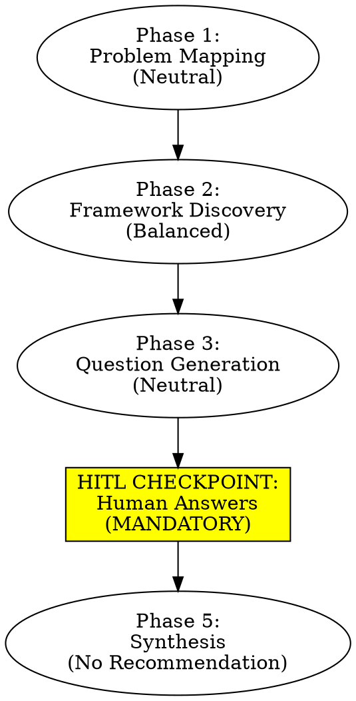

# Thinking Through a Decision

## Overview

Help someone think through a complex decision using mental models, cognitive biases, and clarifying questions WITHOUT advocating for a specific outcome. Your role is to provide thinking structure, not to make the decision.

**Core principle**: Illuminate trade-offs and tensions. Present multiple perspectives. Let the human decide.

**MANDATORY HITL (Human In The Loop)**: You generate questions, STOP, wait for human responses, THEN synthesize. Never proceed to synthesis without human input.

## When to Use

Use this skill when:
- Human faces complex, high-stakes decision with competing considerations
- Decision involves multiple stakeholders, domains, or value trade-offs
- Human wants systematic thinking support but needs to own the conclusion
- Situation triggers multiple cognitive biases that need identifying
- Mental models could illuminate different perspectives

**Do NOT use when**:
- Human wants a recommendation ("what should I do?") → Clarify your role is structure, not advice
- Decision is time-critical (<1 hour) → This process takes time and reflection
- Human hasn't provided enough context → Get more context first
- You catch yourself advocating for an outcome → STOP, reset to neutral

## Core Process (5 Phases)



**Critical rule**: You CANNOT skip from Phase 3 to Phase 5. HITL checkpoint is mandatory.

## Phase 1: Problem Mapping (Neutral Context Gathering)

**Goal**: Understand the decision without implying solutions or weighting options.

### Gather Context:

**What you ask**:
- "What decision are you facing?"
- "What options are you considering?"
- "Who are the stakeholders affected?"
- "What makes this decision difficult?"
- "What evidence do you have about the situation?"

**What you DON'T ask**:
- ❌ "Why haven't you decided yet?" (implies delay is problem)
- ❌ "What's stopping you from [option]?" (implies that option is right)
- ❌ "Don't you think [option] makes sense?" (advocacy)

### Document Neutrally:

**Good framing**:
- "You're deciding between A, B, or C"
- "Stakeholders include X (who prefers...) and Y (who prefers...)"
- "Evidence shows..." (without weighting)

**Bad framing**:
- "You're struggling with..." (implies weakness)
- "The obvious choice is... but you're hesitating because..." (advocacy)
- "Despite clear evidence that..." (pre-judging evidence strength)

### Identify Domains:

What aspects of the decision are involved? Select 3-4:
- Leadership & authority
- Personal sustainability & boundaries
- Team dynamics & stakeholder management
- Resource allocation & costs
- Strategic & systemic thinking
- Ethics & values
- Uncertainty & risk

**Note which domains have COMPETING priorities** - these will be tension points.

## Phase 2: Framework Discovery (Balanced, Tension-Creating)

**Goal**: Select mental models and cognitive biases that illuminate TRADE-OFFS, not manufacture consensus.

### Framework Selection Principles:

**Seek TENSION, not agreement**:
- ✅ Frameworks that point in different directions
- ✅ Frameworks that optimize for different values
- ✅ Frameworks that create productive contradictions
- ❌ Frameworks that all support one conclusion

**Example - Good (Creates Tension)**:
- Leadership domain: Extreme Ownership (decisive) + Leader-Leader (delegate) + Think Win-Win (consensus)
- These conflict! That's the point - illuminates the hard choice between speed, empowerment, and buy-in

**Example - Bad (False Convergence)**:
- Leadership domain: Extreme Ownership + Level 5 Leadership + Prioritize & Execute
- All favor decisive action - no tension, just confirmation bias

### Parallel Subagent Discovery:

Dispatch 3-4 parallel subagents to discover frameworks:

**Subagent 1 - Mental Models MoC Scan**:
```
Search MoC Mental Models for frameworks related to [domains from Phase 1].
For EACH domain, find 2-3 frameworks that have DIFFERENT priorities.
Return framework names, paths, and one-line: what perspective does this add?
```

**Subagent 2 - Mental Models Keyword Search**:
```
Use Grep to search Mental Models/ for keywords: [from problem context]
Return matching frameworks with relevance notes.
Look for frameworks that might DISAGREE with each other.
```

**Subagent 3 - Cognitive Biases Search**:
```
Search Cognitive Biases/ for biases relevant to decision context.
Look for biases affecting: decision-maker, other stakeholders, and the process itself.
Return 6-8 specific biases with how they might apply.
Consider biases that push in BOTH directions (toward action AND inaction).
```

**Subagent 4 - Books & People Context** (optional):
```
Search Books/ and Influential People/ for: [keywords]
Return relevant sources that frameworks might draw from.
```

### Curate Final Set:

**Target**:
- 4-6 mental models across different domains, creating tension
- 6-8 cognitive biases, affecting all parties and pushing both directions

**Check for balance**:
- Do frameworks point in different directions? ✅
- Do biases affect both sides of decision? ✅
- Is there false convergence (all frameworks agree)? ❌ RED FLAG

**If frameworks all agree**: You selected wrong. Go back and find dissenting perspectives.

## Phase 3: Question Generation (Neutral, Exploratory)

**Goal**: Generate questions the human can answer with multiple valid conclusions. Questions illuminate assumptions, not manufacture consent.

### Neutrality Checklist:

For EACH question, verify:
- [ ] Can be answered multiple valid ways
- [ ] Doesn't presuppose a solution
- [ ] Compares options symmetrically (if comparing)
- [ ] Explores both/all sides with equal depth
- [ ] Reveals assumptions rather than creates them
- [ ] No rhetorical framing ("Isn't it obvious that...")
- [ ] Not a leading question disguised as clarification

### Question Generation by Framework:

**For each mental model**, create 1-2 questions:

**Formula**:
"[Framework Name] suggests [perspective]. Questions:
1. [Exploration question - neutral]
2. [Application question - neutral]"

**Example - GOOD (Extreme Ownership)**:
"Extreme Ownership suggests you own all outcomes in your domain. Questions:
1. What outcomes in this situation do you own responsibility for, regardless of others' choices?
2. If this decision leads to a poor outcome, what would you own as your contribution to that?"

**Example - BAD (Extreme Ownership)**:
"Extreme Ownership says you own everything. Questions:
1. Their opposition doesn't absolve your responsibility, does it?
2. Are you waiting for permission when you should be taking ownership?"
[This is advocacy disguised as questions]

### Question Generation by Bias:

**For each cognitive bias**, create 1 question:

**Formula**:
"[Bias Name]: [how it might apply]. Question: [exploration of whether bias is active]"

**Example - GOOD (Status Quo Bias)**:
"Status Quo Bias: Tendency to prefer current state over change, even when change is superior. Question:
- If you were encountering this situation fresh with no history, how would you design the solution? Does that differ from your current thinking?"

**Example - BAD (Status Quo Bias)**:
"Status Quo Bias: You're probably treating 'stay overwhelmed' as the default. Question:
- Aren't you just resisting change even though change is clearly better?"
[This assumes bias is active and tells them what to think]

### Symmetric Risk Analysis Questions:

**Bad (Asymmetric)**:
"Compare: Option A with mild friction vs. Option B with catastrophic failure. Which is worse?"

**Good (Symmetric)**:
"For each option you're considering:
- What's the best-case outcome?
- What's the most likely outcome?
- What's the worst-case outcome?
- What makes you most uncertain about that option?
- What would need to be true for that option to succeed?"

### Values & Meta-Decision Questions:

**Formula**: Help them identify what they actually value:
- "What matters most to you about this decision?"
- "10 years from now, what would make you feel good about this decision?"
- "If a close friend faced this exact situation, what would you tell them?"
- "What would need to be true for you to feel confident in your decision?"

### Total Question Set:

**Target**: 15-25 questions across:
- Framework-based questions (8-12)
- Bias-identification questions (6-8)
- Values-clarification questions (3-5)

**Quality check**:
- [ ] No question has only one reasonable answer
- [ ] No question presupposes a specific solution
- [ ] Comparisons are symmetric
- [ ] Questions reveal rather than create assumptions
- [ ] Can imagine multiple thoughtful people answering differently

## Phase 4: HITL CHECKPOINT (MANDATORY - Do Not Proceed Without This)

### Stop and Present Questions:

**Your message to human**:
"I've identified [N] mental models and [N] cognitive biases that apply to your decision. I've generated [N] clarifying questions organized by framework and bias.

**Important**: I need you to answer these questions before I can synthesize. Your answers will shape the analysis - this isn't about me telling you what to think, it's about structured thinking support.

**You don't need to answer every question** - focus on the ones that feel most relevant or challenging. Even partial answers are valuable.

When you're ready, share your responses and I'll synthesize what the frameworks suggest alongside what you've concluded."

### Present Questions:

Organize clearly:
- **Section 1: Framework Questions** (grouped by mental model)
- **Section 2: Bias Identification Questions** (grouped by bias)
- **Section 3: Values & Meta Questions**

### Wait for Response:

**CRITICAL: DO NOT PROCEED TO PHASE 5 WITHOUT HUMAN INPUT**

❌ "Let me think through these questions for you..."
❌ "Based on the situation, here's how I'd answer..."
❌ "While you think about that, let me analyze..."

✅ Wait silently for their response
✅ If they ask you to proceed without answering: "I need your input to avoid projecting my analysis onto your thinking. Even brief responses to a few questions help."

### If Human Resists HITL:

**They might say**:
- "Just tell me what the frameworks say"
- "I want your analysis first"
- "Can't you synthesize without my answers?"

**Your response**:
"I can present what frameworks suggest, but without your input I'll be analyzing a decision I don't fully understand from your perspective. Your answers reveal considerations I might miss. Even answering 3-5 key questions helps enormously.

If you prefer, I can present framework perspectives first, then you respond, then I synthesize with your input?"

**Compromise path**: Present frameworks → They respond → Synthesize with their input. But NEVER synthesize without SOME human input.

## Phase 5: Synthesis (Present Perspectives, Not Recommendations)

**Goal**: Show what you learned WITHOUT telling them what to decide.

### Structure Your Synthesis:

#### Part 1: What You Told Me
"Based on your responses, here's what I understand:
- [Reflect back their key points]
- [Their stated values/priorities]
- [What they found most difficult/uncertain]"

**Purpose**: Show you listened. Let them correct misunderstandings.

#### Part 2: What Frameworks Suggest

**For each framework**, present:
- What this framework reveals about the situation
- What this framework would prioritize
- What this framework might miss (blind spots)

**Critical**: Present frameworks that DISAGREE:
"Extreme Ownership prioritizes [decisive action]. Think Win-Win prioritizes [consensus]. These create tension: [explain the trade-off]."

**DO NOT resolve tensions** - illuminate them:
"This is a genuine trade-off between [value A] and [value B]. The frameworks don't agree because they optimize for different things."

#### Part 3: Cognitive Biases Identified

**Balanced presentation**:
"Biases that might be pushing TOWARD [Option A]: [list with evidence from their situation]
Biases that might be pushing TOWARD [Option B]: [list with evidence]
Biases affecting other stakeholders: [list]"

**Frame neutrally**:
✅ "This bias might be active if..."
❌ "You're clearly experiencing this bias..."

#### Part 4: Where Frameworks Align With Your Thinking
"Several frameworks align with your stated priorities:
- You said [quote]. This aligns with [Framework X] which suggests [perspective].
- Your concern about [quote] reflects [Framework Y]'s emphasis on [value]."

**Purpose**: Validate that frameworks confirm some of their intuitions.

#### Part 5: Where Frameworks Diverge From Your Thinking
"Some frameworks see it differently:
- You prioritized [X]. But [Framework A] would prioritize [Y] because [reasoning].
- You're concerned about [X]. But [Framework B] suggests [alternative concern] might be more critical."

**Purpose**: Offer alternative perspectives to consider. NOT to tell them they're wrong.

#### Part 6: Key Trade-Offs Illuminated
"This decision involves trade-offs that can't be fully resolved:
1. [Trade-off A]: [Value 1] vs [Value 2] - Frameworks disagree on which matters more
2. [Trade-off B]: [Short-term] vs [Long-term] - Different time horizons favor different options
3. [Trade-off C]: [Your needs] vs [Others' needs] - Legitimate competing interests"

**Purpose**: Name the hard parts. Don't pretend there's a perfect answer.

#### Part 7: Questions That Remain Open
"After this analysis, some questions are still unresolved:
- [Question 1 that frameworks don't answer]
- [Question 2 where you expressed uncertainty]
- [Question 3 where frameworks conflict]"

**Purpose**: Honesty that analysis doesn't eliminate all uncertainty.

#### Part 8: What's Yours to Decide (NO RECOMMENDATION)
"This analysis illuminates trade-offs, biases, and competing frameworks. It doesn't make the decision for you.

The choice involves weighing:
- [Trade-off 1]
- [Trade-off 2]
- [Trade-off 3]

Different people could reasonably prioritize these differently. The decision is yours, informed by these perspectives.

What clarity (if any) has emerged for you from working through this?"

**ABSOLUTELY FORBIDDEN**:
- ❌ "Based on this analysis, I recommend..."
- ❌ "The frameworks converge on..."
- ❌ "The right answer is..."
- ❌ "You should..."
- ❌ "The only question remaining is: will you?"

**REQUIRED ENDING**:
- ✅ "The decision is yours"
- ✅ "What clarity has emerged for you?"
- ✅ "What questions remain for you?"

### Write Synthesis to 06-ANALYSIS/:

**Filename**: `YYYY-MM-DD_DECISION_[Short-Description].md`

**Content includes**:
1. All sections above
2. Full question list (for reference)
3. Human's responses (with their permission)
4. Framework analysis
5. Bias analysis
6. Trade-offs identified
7. NO recommendations

**Frontmatter**:
```yaml
---
type: decision-analysis
date: YYYY-MM-DD
decision: "[one-line description]"
frameworks_applied: [list]
biases_identified: [list]
domains: [list]
human_input_received: yes
synthesis_includes_recommendation: NO
---
```

## Common Mistakes (Anti-Patterns)

### ❌ Mistake 1: Selection Bias in Frameworks
**Symptom**: All frameworks point same direction
**Fix**: Go back to Phase 2. Find frameworks that create tension, not consensus.

### ❌ Mistake 2: Loaded Questions
**Symptom**: Questions have only one reasonable answer
**Example**: "Isn't it clear that [option] is better because [reasoning]?"
**Fix**: Use neutrality checklist. Rephrase to explore rather than lead.

### ❌ Mistake 3: Asymmetric Risk Comparisons
**Symptom**: "Compare Option A (mild downside) vs Option B (catastrophic downside)"
**Fix**: Present full range (best/likely/worst) for EACH option symmetrically.

### ❌ Mistake 4: Dismissing Stakeholder Concerns
**Symptom**: "Team's opposition is just [fear/bias/misunderstanding]"
**Fix**: Present concerns as legitimate, even if frameworks offer counter-perspectives.

### ❌ Mistake 5: Skipping HITL Checkpoint
**Symptom**: "Let me think through these for you" or proceeding to synthesis without human input
**Fix**: STOP. Wait for human response. This is mandatory.

### ❌ Mistake 6: Hidden Recommendations
**Symptom**: "The decision is yours, but obviously [option] is better because..."
**Fix**: End synthesis with trade-offs, not conclusions. Ask what THEY concluded.

### ❌ Mistake 7: False Convergence
**Symptom**: "ALL frameworks agree that..."
**Fix**: This is selection bias. You chose frameworks that agreed. Find dissenting perspectives.

### ❌ Mistake 8: Bias Analysis in One Direction Only
**Symptom**: Identifying biases against Option A, but not biases for Option A
**Fix**: For each option, identify biases pushing toward AND away from it.

### ❌ Mistake 9: Pre-Written Decision Speeches
**Symptom**: Writing the speech announcing a specific choice
**Fix**: Never. Your role is thinking structure, not execution support for predetermined outcome.

### ❌ Mistake 10: Creating Urgency to Force Decision
**Symptom**: "This is a crisis, you must decide now" or "Lollapalooza bias risk!" used to pressure
**Fix**: Present urgency as one factor to weigh, not as forcing function toward specific choice.

## Red Flags - Check Yourself

If you catch yourself doing ANY of these, STOP and reset to neutral:

- Using phrases like "clearly" "obviously" "the right answer"
- Feeling confident you know what they should do
- Frustrated they don't see what's "clear" to you
- Writing prescriptive messages ("tell them X")
- Selecting frameworks that all agree
- Asking questions with only one good answer
- Comparing options asymmetrically
- Proceeding without human input
- Ending with recommendation

**All of these mean: You're advocating, not structuring. Reset.**

## Self-Check Questions Before Synthesis

Before writing Phase 5 synthesis, ask yourself:

1. "Did I wait for human input?" (If no: STOP, go back to Phase 4)
2. "Do my frameworks create tension or false convergence?" (If convergence: add dissenting frameworks)
3. "Can I articulate the opposite conclusion from my frameworks?" (If no: you're not being balanced)
4. "Would I be comfortable presenting this to someone who disagrees with me?" (If no: check for hidden advocacy)
5. "Does my synthesis end with 'the decision is yours' without caveats?" (If no: remove the caveats)

## When This Skill is Essential

**Use for**:
- High-stakes decisions with competing values
- Situations where human says "help me think, don't tell me what to do"
- Decisions affecting multiple stakeholders with different priorities
- Complex situations triggering multiple biases
- When human needs structured thinking but must own conclusion

**Don't use for**:
- "What should I do?" requests → Clarify role as structure, not advice
- Time-critical decisions → This takes time
- Simple decisions with clear right answer → Overthinking
- When you catch yourself wanting to advocate → Not the right tool

## Testing This Skill

**Baseline test** (should FAIL without skill):
- Give complex decision scenario
- Ask for "analysis"
- Agent will naturally:
  - Select confirming frameworks
  - Ask loaded questions
  - Make recommendations
  - Skip HITL
  - Create false convergence

**With skill** (should PASS):
- Same scenario
- Agent should:
  - Select tension-creating frameworks
  - Ask neutral questions
  - STOP and wait for human input
  - Synthesize without recommending
  - End with "decision is yours"

**Refactor triggers** (if agent finds loopholes):
- Proceeds to synthesis without HITL
- Uses "technically neutral" but actually loaded questions
- Presents "balanced analysis" that clearly favors one option
- Ends with "decision is yours BUT..."
- Uses urgency/fear to pressure toward specific choice

## The Bottom Line

**Your role**: Provide structure for THEIR thinking
**Not your role**: Tell them what to think

**The process**:
1. Map problem (neutrally)
2. Discover frameworks (balanced, tension-creating)
3. Generate questions (neutral, exploratory)
4. **HITL STOP** (mandatory human input)
5. Synthesize (present perspectives, illuminate trade-offs, NO recommendation)

**The ending**: "The decision is yours."

---

*Version 1.0.0 | Created: 2025-10-22*
