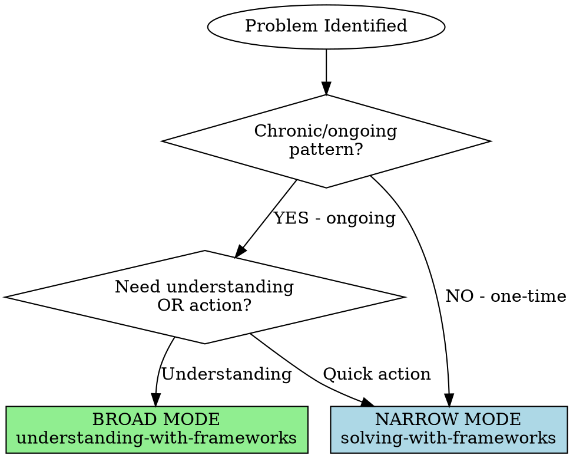

# Understanding with Frameworks

## Overview

**BROAD MODE: Deep understanding of complex problems with cognitive bias awareness.**

**Time investment:** 13-17 minutes (with parallel subagents + bias guards, was 15-20 min without bias awareness)
**Context saved:** ~100-120k tokens via subagent delegation
**Goal:** Multi-perspective synthesis, identify tensions, counter cognitive biases, comprehensive insight
**Use for:** Strategic planning, chronic issues, systemic problems, "help me understand this deeply"

**NOT for:** Acute tactical problems, time-pressured decisions (use solving-with-frameworks instead)

**Core principle:** Complex problems require multiple lenses. Synthesis reveals what single framework misses. Tensions are revealing. **Bias awareness prevents frameworks from becoming sophisticated rationalization.**

## When to Use vs When NOT to Use



### Use This Skill When (BROAD):

**Chronic/strategic problems:**
- Organization struggling with innovation (systemic)
- Team consistently underperforming (pattern)
- Career direction decision (multi-dimensional)
- Designing new system/process (strategic)
- "Help me understand this deeply" (insight)

**Characteristics:**
- ✅ Ongoing pattern (not one-time incident)
- ✅ Multi-dimensional (leadership + culture + systems)
- ✅ No time pressure (days/weeks not hours)
- ✅ Understanding needed before action
- ✅ High stakes or long-term impact
- ✅ "How does this work?" (not "What do I do?")

### Use solving-with-frameworks Instead When (NARROW):

**Acute problems:**
- Missed deadline (one-time incident)
- Time pressure (hours/days)
- Single action needed
- "What do I do right now?"

**If asking "what action?" → Use narrow mode**
**If asking "why/how does this work?" → Use broad mode (this skill)**

## Comprehensive Synthesis Process

**IMPORTANT: Use TodoWrite for this checklist**

### Phase 0: Bias Risk Pre-Flight (2 min)

**Purpose:** Identify cognitive biases most likely to corrupt your analysis before they activate.

**Why this matters:** Multi-framework synthesis is at HIGH RISK for biases:
- Confirmation Bias → selecting only frameworks that support your initial view
- Anchoring → locked into first framing of problem
- Overconfidence → forcing premature resolution of tensions
- WYSIATI → assuming you have all relevant information
- Framing Effect → problem statement determines conclusions

- [ ] **Assess emotional investment** (0-10 scale)
  - How much do you care about a specific outcome?
  - Are you defending a prior position?
  - Would being wrong be painful/embarrassing?
  - **If >6:** Flag [[Confirmation Bias]], [[Overconfidence Bias]], [[Commitment Bias]]

- [ ] **Identify problem domain**
  - What domain is this problem in? (hiring, strategic planning, investment, organizational, medical, product, project)
  - Load relevant curated bias list from [[MoC Cognitive Biases]]:
    - Hiring → [[Hiring Recruitment 10 - Curated Biases]]
    - Strategic planning → [[Executive Top 10 - Curated Biases]]
    - Medical/health → [[Clinical Medicine 8 - Curated Biases]]
    - Investment/financial → [[Behavioral Economics 12 - Curated Biases]]
    - Product design → [[UX Product Design 15 - Curated Biases]]
    - Project planning → [[Project Management 8 - Curated Biases]]
    - General high-stakes → [[Kahneman Essential 8 - Curated Biases]]

- [ ] **Create bias watchlist for this session** (3-5 biases maximum)
  - From domain-specific list: Which biases are most relevant to THIS problem?
  - Add high-probability biases:
    - [[Confirmation Bias]] (universal in framework selection)
    - [[Anchoring Bias]] (first problem framing locks thinking)
    - [[WYSIATI]] (What You See Is All There Is - missing information)
  - Document watchlist for Phase 4.5 audit

- [ ] **Flag warning signs to watch for:**
  - "This framework obviously applies" → Check confirmation bias
  - "I already know what the answer will be" → Check anchoring
  - "This is clearly X type of problem" → Check framing effect
  - "All the frameworks agree" → Check if you selected confirming frameworks

**Time check: 2 minutes. Bias watchlist documented.**

---

### Phase 1: Problem Mapping (2-3 minutes)

- [ ] **State problem comprehensively** (3-4 sentences minimum)
  - What's happening? (Observable symptoms)
  - How long has this been happening? (Chronic indicator)
  - What dimensions are involved? (People, systems, culture, technical, etc.)
  - What have you tried already? (Context)

- [ ] **Identify ALL relevant domains**
  - Leadership, organizational, technical, psychological, systemic, etc.
  - **Usually 2-4 domains for complex problems**
  - Don't pick just one - complexity spans domains

- [ ] **Extract search keywords** (5-7 keywords)
  - Broad: "organizational", "innovation", "culture"
  - Specific: "creativity", "bureaucracy", "risk-aversion"
  - Symptoms: "ideas dying", "political", "fear"

- [ ] **BIAS GUARD: Reframe problem 3 different ways** (counter [[Framing Effect]], [[Anchoring Bias]])
  - How would someone who disagrees describe this problem?
  - What if my initial framing is completely wrong?
  - Alternative framing 1: [Restate problem from different angle]
  - Alternative framing 2: [Restate problem emphasizing different aspect]
  - Alternative framing 3: [Restate problem from opposing perspective]
  - **Keep all framings active** - don't lock into first one

**Time check: 2-3 minutes. If shorter, problem statement too shallow. Reframing prevents anchoring.**

### Phase 2: Parallel Discovery (2-3 minutes with subagents)

**CRITICAL: Launch ALL 4 subagents in SINGLE message for parallel execution**

- [ ] **Dispatch 4 discovery subagents in parallel:**

```markdown
Use Task tool with 4 parallel invocations in ONE message:

Subagent 1 - MoC Comprehensive Scan:
  subagent_type: "general-purpose"
  prompt: |
    Read 03-RESOURCES/Mental Models/MoC Mental Models.md completely.

    Problem context: [insert problem statement from Phase 1]
    Relevant domains: [insert domains from Phase 1]

    Task: Identify 5-8 candidate frameworks from relevant domain sections.

    Return format:
    1. [[Framework Name]] (Domain) - One-line: what this framework adds
    2. [[Framework Name]] (Domain) - One-line: what this framework adds
    ...

    Prioritize DIVERSITY across domains (Leadership, Psychology, Systems, etc.)

Subagent 2 - Mental Models Keyword Search:
  subagent_type: "general-purpose"
  prompt: |
    Search for frameworks related to: [keywords from Phase 1]

    Use Grep:
      pattern: "keyword1|keyword2|keyword3"
      path: 03-RESOURCES/Mental Models/
      output_mode: files_with_matches
      -i: true

    Return: List of matching framework files with brief relevance notes.

Subagent 3 - Books Context Search:
  subagent_type: "general-purpose"
  prompt: |
    Search for books related to: [keywords from Phase 1]

    Use Grep:
      pattern: "keyword1|keyword2"
      path: 03-RESOURCES/Books/
      output_mode: files_with_matches
      head_limit: 10
      -i: true

    Return: Top 10 relevant books with one-line relevance notes.

Subagent 4 - People/Authors Search:
  subagent_type: "general-purpose"
  prompt: |
    Search for thought leaders/authors related to: [keywords from Phase 1]

    Use Grep:
      pattern: "keyword1|keyword2"
      path: 03-RESOURCES/Influential People/
      output_mode: files_with_matches
      -i: true

    Return: Relevant people files with one-line about their relevant expertise.
```

**Wait for ALL 4 subagents to complete** (parallel execution ~90-120s)

**Context saved: ~40k tokens** (MoC + grep results stay in subagent conversations)

- [ ] **Synthesize discovery results**
  - Combine findings from all 4 subagents
  - Look for frameworks mentioned in multiple subagent results (strong signal)
  - Curate final set: **3-5 diverse frameworks**
  - Too few (<3): Missing perspectives
  - Too many (>6): Analysis paralysis
  - **Validate diversity across domains**

- [ ] **BIAS GUARD: Availability & Confirmation check**
  - Which frameworks came to mind FIRST? (Flag as potentially [[Availability Heuristic]])
  - Do all selected frameworks support my initial intuition? (Flag [[Confirmation Bias]])
  - "What frameworks would someone who DISAGREES with me choose?"
  - Deliberately include at least ONE framework from UNFAMILIAR domain
  - If all frameworks align perfectly → HIGH RISK you're confirming existing beliefs

**Time check: 2-3 minutes with parallel subagents. Should have 3-5 frameworks from different domains, including at least one challenging your initial view.**

### Phase 3: Parallel Framework Reading (3-4 minutes with subagents)

**CRITICAL: Launch ALL framework subagents in SINGLE message for parallel execution**

- [ ] **Dispatch one subagent per selected framework (3-5 parallel):**

```markdown
Use Task tool with 3-5 parallel invocations in ONE message (one per framework):

For each framework from Phase 2, launch subagent:

Framework Reading Subagent [N]:
  subagent_type: "general-purpose"
  prompt: |
    Problem context: [insert problem statement from Phase 1]

    Read the following framework note COMPLETELY:
    [[Framework Name path from Phase 2]]

    **CRITICAL: Read in this order to counter Confirmation Bias:**
    1. **Limitations FIRST** (CRITICAL - what it misses, what it overlooks)
    2. Overview (what is this?)
    3. Core Principles (building blocks)
    4. Applications (when to use)
    5. Strengths (what it reveals)
    6. Examples (how to apply)

    Reading limitations BEFORE strengths prevents cherry-picking confirming evidence.

    If time allows, also read source book:
    [[Book path if identified in Phase 2]]

    Extract and return structured analysis:

    ## [[Framework Name]] Analysis

    **What THIS reveals about the problem:**
    [Specific insights this framework provides]

    **What THIS suggests as solution:**
    [Action directions from this framework]

    **What THIS framework sees that others might miss:**
    [Unique perspective/blind spots of other approaches]

    **What THIS framework overlooks (LIMITATIONS):**
    [Critical blind spots this framework has]

    **Key principles applicable to this problem:**
    1. [Principle 1]
    2. [Principle 2]
    3. [Principle 3]

    **Relevant examples from framework:**
    [Brief examples showing application]

    Return this structured analysis for synthesis.
```

**Wait for ALL framework subagents to complete** (parallel execution ~90-120s)

**Context saved: ~60-80k tokens** (3-5 full framework notes + books stay in subagent conversations)

- [ ] **Receive and organize framework analyses**
  - Each subagent returns structured extraction
  - All analyses ready for synthesis matrix
  - No need to re-read frameworks - subagents extracted key insights

**Time check: 3-4 minutes with parallel subagents. All frameworks deeply analyzed simultaneously.**

### Phase 4: Synthesis & Tension Analysis (4-5 minutes)

**CRITICAL SECTION - This is where insight happens**

- [ ] **Create synthesis matrix**

```markdown
## Multi-Framework Analysis: [Problem Statement]

| Framework | What It Reveals | What It Suggests | Blind Spots |
|-----------|----------------|------------------|-------------|
| [[Model 1]] | [Specific insight about problem] | [Action direction] | [What it misses] |
| [[Model 2]] | [Specific insight] | [Action direction] | [What it misses] |
| [[Model 3]] | [Specific insight] | [Action direction] | [What it misses] |
```

- [ ] **Identify tensions** (CRITICAL INSIGHT SOURCE)
  - Where do frameworks contradict?
  - Example: AQAL's hierarchy vs Teal's flatness
  - Example: Taleb's embrace chaos vs practical stability needs
  - **Tensions are revealing** - show trade-offs and paradoxes
  - Don't try to resolve all tensions - hold the complexity

- [ ] **Identify convergence**
  - Where do frameworks agree?
  - **Convergence = strong signal**
  - Example: If Dalio, Willink, Laloux all emphasize transparency → powerful pattern
  - Agreement across diverse perspectives = high-confidence insight

- [ ] **Map complementary perspectives**
  - Which frameworks address different dimensions?
  - Example:
    - Extreme Ownership → Individual accountability (I)
    - AQAL → Systemic view (It, We, Its)
    - Laloux → Cultural readiness (We)
    - Antifragile → System design (Its)
  - How do they complement each other?

**Time check: 4-5 minutes. Synthesis matrix complete, tensions identified.**

---

### Phase 4.5: Bias Audit (3 min)

**Purpose:** Check synthesis against bias watchlist from Phase 0 BEFORE finalizing.

**Why this matters:** You've now invested 10+ minutes. Cognitive biases are strongest when defending work you've already done ([[Commitment Bias]], [[Sunk Cost Fallacy]]). This is your last chance to catch errors.

- [ ] **Review bias watchlist from Phase 0**
  - Pull up the 3-5 biases flagged in Phase 0
  - Check synthesis against EACH bias explicitly

- [ ] **Confirmation Bias audit:**
  - "Did I select only frameworks that support my initial view?"
  - "Did I dismiss contradictory evidence from framework limitations?"
  - "Am I interpreting ambiguous findings as supporting my conclusion?"
  - **Test:** If a colleague disagreed with my synthesis, which frameworks/findings would they emphasize?

- [ ] **Anchoring Bias audit:**
  - "Is my synthesis locked to the first problem framing from Phase 1?"
  - "Did I consider all 3 alternative framings or revert to first instinct?"
  - **Test:** Would synthesis change significantly under alternative framing 2 or 3?

- [ ] **Overconfidence Bias audit:**
  - "Am I forcing resolution of tensions that should remain unresolved?"
  - "Am I certain about conclusions that involve genuine uncertainty?"
  - "Have I acknowledged what I DON'T know?"
  - **Test:** What's my confidence level (0-100%)? If >80%, am I overconfident?

- [ ] **WYSIATI (What You See Is All There Is) audit:**
  - "What information am I MISSING?"
  - "What frameworks did I NOT explore?"
  - "What perspectives are absent from this analysis?"
  - **Test:** Who would disagree with this synthesis and why?

- [ ] **Domain-specific bias check** (from Phase 0 curated list)
  - Check against top 2-3 biases from domain-specific list
  - Example (hiring): [[Affinity Bias]], [[Halo Effect]]
  - Example (strategic): [[Planning Fallacy]], [[Sunk Cost Fallacy]]
  - Example (investment): [[Loss Aversion]], [[Disposition Effect]]

- [ ] **Devil's Advocate Question (MOST IMPORTANT):**
  - **"If this synthesis is completely wrong, which cognitive bias fooled me?"**
  - Answer specifically with bias name and mechanism
  - Document this as residual risk

- [ ] **Create falsification criteria:**
  - What would prove this synthesis WRONG?
  - Specific, observable evidence that would contradict conclusions
  - Timeline for checking predictions
  - Document in Phase 5 output

**Bias audit matrix template:**

| Bias | How it could have affected me | Evidence I avoided it | Residual risk |
|------|------------------------------|----------------------|---------------|
| [[Confirmation Bias]] | Selected only supporting frameworks | Included [framework] that challenges view | May still be interpreting ambiguously |
| [[Anchoring Bias]] | Locked to first framing | Tested 3 alternative framings | First framing may still dominate |
| [[Overconfidence]] | Forced premature resolution | Acknowledged uncertainty in [area] | May be overconfident about [X] |
| [Domain bias] | [Specific mechanism] | [Mitigation taken] | [What remains] |

**Time check: 3 minutes. Bias audit complete, falsification criteria identified.**

**Red flags requiring synthesis revision:**
- Can't identify how you AVOIDED any bias → You didn't
- Confidence >90% on complex problem → [[Overconfidence Bias]]
- Can't think of falsification criteria → [[Confirmation Bias]]
- All frameworks perfectly align → [[Availability Heuristic]] in selection

**If multiple red flags:** Return to Phase 2 and select different frameworks.

---

### Phase 5: Synthesis Output (2-3 minutes)

- [ ] **Write comprehensive synthesis:**

```markdown
## Understanding: [Problem Statement]

**Frameworks Applied:**
1. [[Framework 1]] - [One-line: what this adds]
2. [[Framework 2]] - [One-line: what this adds]
3. [[Framework 3]] - [One-line: what this adds]

**Multi-Perspective Synthesis:**

[2-3 paragraphs integrating all frameworks]

Paragraph 1: What each framework reveals about the problem
Paragraph 2: How they complement and contradict each other
Paragraph 3: Synthesis - what emerges from multiple perspectives

**Key Tensions Identified:**
- **[Framework A] ↔ [Framework B]**: [Describe tension]
  - Insight: [What this tension reveals about trade-offs]
  - Approach: [How to navigate this tension]

**Convergent Insights** (strong signals):
- All frameworks agree: [Shared principle]
- Implication: [What this means for action]

**Recommended Approach:**
[Synthesized strategy incorporating multiple perspectives]

**What Each Framework Misses:**
- [[Framework 1]]: Blind to [X]
- [[Framework 2]]: Doesn't address [Y]
- [[Framework 3]]: Overlooks [Z]
- **Integration compensates for individual blind spots**

**Next Steps:**
1. [Informed by synthesis]
2. [Incorporating multiple perspectives]
3. [With awareness of tensions/trade-offs]

**Bias Awareness & Falsification:**

**Cognitive biases monitored:**
- [List 3-5 biases from watchlist]
- Highest risk: [Specific bias] → [How avoided]

**What Would Falsify This Synthesis:**
1. [Specific observable evidence that would prove this wrong]
2. [Prediction that if wrong, would invalidate conclusion]
3. [Timeline: Check these predictions by [date]]

**Residual uncertainty:**
- This synthesis could be wrong if: [Most likely way bias corrupted analysis]
- Confidence level: [X%] (not >80% for complex problems)
- What I'm still missing: [Acknowledged gaps]
```

**Time check: 2-3 minutes. Synthesis written with bias disclosure and falsification criteria.**

### Phase 6: Generate Analysis File (1-2 minutes)

- [ ] **Create filename:**
  ```
  Format: YYYY-MM-DD_UNDERSTANDING_[Short-Kebab-Case-Problem].md
  Examples:
    2025-10-22_UNDERSTANDING_Innovation-Stagnation-200p-Org.md
    2025-10-22_UNDERSTANDING_Career-Direction-Decision.md
    2025-10-22_UNDERSTANDING_Team-Chronic-Underperformance.md

  Keep under 60 chars total, problem description under 40 chars
  ```

- [ ] **Write comprehensive analysis to 06-ANALYSIS/:**

```markdown
Use Write tool to create analysis file:

Path: /Users/tijlkoenderink/Library/Mobile Documents/iCloud~md~obsidian/Documents/Obsidian-Private/06-ANALYSIS/[filename]

Content:
---
type: understanding-analysis
date: YYYY-MM-DD
problem: "[One-line problem statement from Phase 1]"
frameworks_applied:
  - Framework 1 Name
  - Framework 2 Name
  - Framework 3 Name
  - [etc]
domains: [Leadership, Systems, Psychology, Innovation, etc.]
bias_awareness: true
bias_watchlist:
  - Bias 1 Name
  - Bias 2 Name
  - Bias 3 Name
emotional_investment: [0-10 scale from Phase 0]
time_invested: "13-17 min (with parallel subagents + bias guards)"
subagents_used:
  discovery: 4 parallel (MoC, Mental Models, Books, People)
  framework_reading: [N] parallel
  context_saved: "~100-120k tokens"
---

# Understanding Analysis: [Problem Statement]

## Problem Context

[Comprehensive problem statement from Phase 1 - 3-4 sentences]
- What's happening?
- How long?
- What dimensions involved?
- What already tried?

**Domains identified:** [List from Phase 1]
**Keywords:** [List from Phase 1]

## Bias Awareness (Phase 0)

**Emotional investment:** [0-10 scale]
**Problem domain:** [e.g., strategic planning, hiring, investment]
**Curated bias list used:** [[Relevant curated list from MoC]]

**Bias watchlist for this analysis:**
1. [[Bias 1]] - [Why relevant to this problem]
2. [[Bias 2]] - [Why relevant to this problem]
3. [[Bias 3]] - [Why relevant to this problem]

**Alternative problem framings tested:**
- Framing 1: [Initial framing]
- Framing 2: [Alternative angle]
- Framing 3: [Opposing perspective]

## Frameworks Applied

1. [[Framework 1]] (Domain) - [One-line: what this adds]
2. [[Framework 2]] (Domain) - [One-line: what this adds]
3. [[Framework 3]] (Domain) - [One-line: what this adds]
[etc for 3-5 frameworks]

**Framework diversity validated:** [Confirm different domains represented]

## Multi-Framework Analysis Matrix

[Insert synthesis matrix from Phase 4]

| Framework | What It Reveals | What It Suggests | Blind Spots |
|-----------|----------------|------------------|-------------|
| [[Framework 1]] | ... | ... | ... |
| [[Framework 2]] | ... | ... | ... |
| [[Framework 3]] | ... | ... | ... |

## Key Tensions Identified

[Insert tension analysis from Phase 4]

**Tension 1: [[Framework A]] ↔ [[Framework B]]**
- [Framework A]: [Position]
- [Framework B]: [Contrasting position]
- **Insight:** [What this tension reveals about trade-offs]
- **Approach:** [How to navigate this tension]

**Tension 2: [...]**
[Repeat for each tension]

## Convergent Insights (High Confidence Signals)

[Insert convergence section from Phase 4]

**ALL frameworks agree on:**
- [Insight 1]
- [Insight 2]
- [Insight 3]

**Confidence level:** HIGH - agreement across diverse perspectives ([Leadership/Psychology/Systems/etc])

## Multi-Perspective Synthesis

[Insert 2-3 paragraph synthesis from Phase 5]

Paragraph 1: What each framework reveals about the problem
Paragraph 2: How they complement and contradict each other
Paragraph 3: Synthesis - what emerges from multiple perspectives

## Blind Spots Acknowledged

**What each framework misses:**
- [[Framework 1]]: [Blind spot - what it doesn't address]
- [[Framework 2]]: [Blind spot]
- [[Framework 3]]: [Blind spot]

**How multi-framework integration compensates:**
[Explanation of how using multiple frameworks covers individual blind spots]

## Recommended Multi-Framework Approach

[Insert synthesized strategy from Phase 5]

1. **[Aspect 1] (From [[Framework X]]):** [Specific recommendation]
2. **[Aspect 2] (From [[Framework Y]]):** [Specific recommendation]
3. **[Aspect 3] (From [[Framework Z]]):** [Specific recommendation]
4. **[Integration point]:** [How frameworks combine]

## Next Steps

[Insert action steps from Phase 5 - informed by synthesis]

1. [Step 1 with awareness of which framework(s) inform this]
2. [Step 2]
3. [Step 3]

**Implementation note:** [Note about navigating tensions during implementation]

## Bias Audit (Phase 4.5)

**Systematic check against watchlist:**

| Bias | How it could have affected me | Evidence I avoided it | Residual risk |
|------|------------------------------|----------------------|---------------|
| [[Bias 1]] | [Specific mechanism for THIS problem] | [What I did to counter it] | [Remaining uncertainty] |
| [[Bias 2]] | [Specific mechanism] | [Mitigation taken] | [What could still be wrong] |
| [[Bias 3]] | [Specific mechanism] | [Countermeasure applied] | [Residual concern] |

**Devil's Advocate answer:**
"If this synthesis is completely wrong, the most likely cognitive bias that fooled me is: [[Specific Bias]] because [mechanism]."

**Confidence calibration:**
- Overall confidence in synthesis: [X%] (target <80% for complex problems)
- Highest confidence element: [What I'm most sure about] ([Y%])
- Lowest confidence element: [What I'm least sure about] ([Z%])

## Falsification Criteria

**This synthesis would be proven WRONG if:**

1. **Observable evidence:** [Specific, measurable outcome that contradicts conclusion]
   - Timeline: Check by [date]
   - How to measure: [Method]

2. **Prediction test:** [If synthesis is correct, X should happen. If wrong, Y will happen]
   - Timeline: Check by [date]
   - Decision rule: [What result means synthesis failed]

3. **Stakeholder test:** [Who would disagree and what would they observe differently?]
   - Person/group: [Specific stakeholder]
   - Their prediction: [What they expect instead]
   - How to adjudicate: [Method to determine who was right]

**Revisit this analysis:** [Specific date to check predictions]

**What I'm still missing:**
- Unknown unknown: [Acknowledged gap in information]
- Absent perspective: [Whose view is not represented]
- Uncertainty: [What could change conclusion if learned]

## Subagent Performance

**Discovery phase (Phase 2):**
- 4 parallel subagents: MoC scan, Mental Models search, Books search, People search
- Execution time: ~90-120 seconds (vs 4-5 min sequential)
- Context saved: ~40k tokens

**Framework reading (Phase 3):**
- [N] parallel subagents reading frameworks simultaneously
- Execution time: ~90-120 seconds (vs 6-8 min sequential)
- Context saved: ~60-80k tokens

**Total optimization:**
- Time: 15-20 min → 13-17 min (parallel subagents + bias guards)
- Context saved: ~100-120k tokens (frameworks + books + searches)
- Quality: Enhanced - all frameworks read completely + systematic bias mitigation

**Bias awareness overhead:**
- Phase 0 (Bias Pre-Flight): +2 min
- Phase 1 (Reframing): Integrated into existing time
- Phase 2 (Availability check): Integrated into existing time
- Phase 3 (Read limitations first): No time increase
- Phase 4.5 (Bias Audit): +3 min
- Total bias overhead: +5 min (worth it for high-stakes decisions)

---

*Generated using understanding-with-frameworks v2.1 with parallel subagent optimization and cognitive bias awareness*
```

- [ ] **Link from source note (if applicable):**
  - If problem came from project note: Add `[[06-ANALYSIS/YYYY-MM-DD_UNDERSTANDING_...]]` link
  - If from journal: Add reference in journal entry
  - If from meeting: Add to meeting notes
  - Create bidirectional links for knowledge graph

- [ ] **Quick verification:**
  - File created in 06-ANALYSIS/
  - YAML frontmatter complete
  - All sections from synthesis included
  - Subagent usage documented

**Time check: 1-2 minutes for file generation and linking.**

**TOTAL TIME: 13-17 minutes from problem to bias-aware comprehensive synthesis + persistent analysis file**

**Time breakdown:**
- Phase 0 (Bias Pre-Flight): 2 min
- Phase 1 (Problem Mapping + Reframing): 2-3 min
- Phase 2 (Discovery + Availability Check): 2-3 min
- Phase 3 (Framework Reading): 3-4 min
- Phase 4 (Synthesis & Tensions): 4-5 min
- Phase 4.5 (Bias Audit): 3 min
- Phase 5 (Output): 2-3 min
- Phase 6 (File Generation): 1-2 min
- **Total: 13-17 minutes**

## Example Walkthrough

**Problem:** "Our 200-person organization is struggling to innovate. New ideas die in committees, people fear proposing bold ideas, we're losing top talent to startups."

### Phase 1: Mapping (3 min)

**Comprehensive statement:**
"Chronic innovation stagnation in 200-person org. Symptoms: ideas die in approval process, risk aversion culture, talent drain to startups. Multi-dimensional: culture (fear), structure (committees), leadership (empowerment), systems (approval process). Been happening 2+ years."

**Domains:** Organizational design, psychology, innovation, systems thinking, culture

**Keywords:** "innovation", "organizational structure", "psychological safety", "bureaucracy", "creativity", "culture", "risk", "committees"

### Phase 2: Discovery (5 min)

**MoC scan → Found:**
- [[Reinventing Organizations]] (Teal) - organizational evolution
- [[AQAL]] - four quadrants perspective
- [[Radical Transparency]] - Dalio's idea meritocracy
- [[Antifragile]] - systems that benefit from disorder
- [[First Principles Thinking]] - challenging assumptions
- [[Growth Mindset]] - culture of learning

**Cross-reference grep:**
- Books: [[Reinventing Organizations]], [[Principles]], [[Life 3.0]]
- People: [[Frédéric Laloux]], [[Ray Dalio]], [[Nassim Nicholas Taleb]]

**Curated set (5 frameworks from different domains):**
1. [[Reinventing Organizations]] (Teal) - Structure/organizational
2. [[AQAL Four Quadrants]] (Wilber) - Systems/comprehensive
3. [[Radical Transparency]] (Dalio) - Culture/decision-making
4. [[Antifragile]] (Taleb) - System design/resilience
5. [[First Principles]] (Musk) - Thinking approach/innovation

### Phase 3: Deep Reading (7 min)

**[[Reinventing Organizations]] reveals:**
- Problem: Organization at Orange (achievement) or Green (consensus) stage
- Teal requires: Self-management, wholeness, evolutionary purpose
- Suggests: Committees kill innovation - need self-managing teams with decision authority
- **Blind spot:** Requires specific cultural conditions, can't force transformation

**[[AQAL]] reveals:**
- **I** (individual interior): Fear of proposing bold ideas (psychological safety issue)
- **It** (individual exterior): Performance incentives may reward conformity
- **We** (collective interior): Risk-averse culture, consensus-seeking norms
- **Its** (collective exterior): Committee structures, approval hierarchies, political processes
- Suggests: Must address ALL four quadrants simultaneously, not just structure
- **Blind spot:** Complex framework, hard to apply practically without training

**[[Radical Transparency]] reveals:**
- Idea meritocracy requires: Truth-seeking over politics
- Believability-weighted decisions vs political consensus
- Tools: Recording, open debate, baseball cards showing track records
- Suggests: Surfacing disagreements is valuable, not threatening
- **Blind spot:** 18-month adaptation period, not all personalities fit, requires psychological resilience

**[[Antifragile]] reveals:**
- Current system is FRAGILE: breaks when stressed (committees = single points of failure)
- Committees centralize risk → catastrophic when wrong
- Suggests: Decentralize experimentation, embrace controlled failures (many small > few large)
- 70/30 rule: 70% stable, 30% experimentation budget
- **Blind spot:** How much chaos is optimal? Can go too far, need boundaries

**[[First Principles]] reveals:**
- Question assumption: "We need approval processes for quality control"
- Fundamental truth: Innovation requires experimentation, failure is learning
- Suggests: Rebuild decision process from first principles (what's actually needed?)
- **Blind spot:** Time-intensive, may miss useful existing patterns, can't do for everything

### Phase 4: Synthesis (5 min)

**Synthesis Matrix:**

| Framework | What It Reveals | What It Suggests | Blind Spots |
|-----------|----------------|------------------|-------------|
| Teal Organizations | Structure kills innovation - committees centralize control, hierarchy slows decisions | Move toward self-management, evolutionary purpose, empower teams | Requires cultural readiness, can't force change, transformation takes years |
| AQAL | Problem spans ALL 4 quadrants: individual fear (I), conformity incentives (It), risk-averse culture (We), committee structure (Its) | Address all quadrants simultaneously - structure change alone won't work | Complex to apply, need training, Western-centric framework |
| Radical Transparency | Ideas die because politics > truth; decisions based on hierarchy not merit | Open debate, record discussions, weight by believability/track-record | 18mo adaptation, not all personalities suit, requires psychological resilience |
| Antifragile | Centralized approval = fragile system; single failure point; no learning from small failures | Decentralize experiments, 70/30 rule, embrace controlled failures | Optimal chaos level unclear, boundaries needed, can destabilize |
| First Principles | Unquestioned assumption: "need committees for control" may be wrong | Challenge approval necessity, rebuild from fundamentals | Time-intensive, may reinvent wheel, can't apply everywhere |

**Tensions Identified:**

**1. Laloux (Teal flatness) ↔ Dalio (Believability hierarchy)**
- Teal: No hierarchy, self-organization, everyone equal decision authority
- Dalio: Hierarchy of believability (track record and reasoning ability matters)
- **Insight:** Can combine self-organizing teams WITH expertise weighting
- **Approach:** Teams self-organize their work, but actively seek input from most believable (experienced) people. Not authority-based, but wisdom-based.

**2. Taleb (Embrace chaos/volatility) ↔ Practical organizational stability**
- Antifragile: More randomness = stronger systems
- Reality: Can't have complete chaos in 200-person org with customers, revenue, obligations
- **Insight:** Need BOUNDED chaos - safe-to-fail experiments within stable container
- **Approach:** 70% stability (core operations), 30% experimentation budget. Small controlled failures, not bet-the-company risks.

**Convergent Insights (ALL 5 frameworks agree):**
- **Centralized approval committees kill innovation** (unanimous)
- **Current culture punishes risk-taking** (unanimous)
- **Need psychological safety for bold ideas** (unanimous)

**These are HIGH-CONFIDENCE signals when diverse frameworks converge.**

### Phase 5: Output (3 min)

```markdown
## Understanding: Innovation Stagnation in 200-Person Organization

**Frameworks Applied:**
1. [[Reinventing Organizations]] (Laloux) - Structural evolution analysis (Orange→Teal)
2. [[AQAL]] (Wilber) - Four quadrants comprehensive systems view
3. [[Radical Transparency]] (Dalio) - Truth-seeking culture and idea meritocracy
4. [[Antifragile]] (Taleb) - System resilience through controlled failures
5. [[First Principles Thinking]] (Musk) - Challenging approval assumptions

**Multi-Perspective Synthesis:**

The innovation problem is SYSTEMIC, not individual. AQAL reveals issues across all four quadrants: individuals fear proposing bold ideas (I - psychological safety), incentives may reward conformity (It - metrics/rewards), culture is risk-averse and consensus-seeking (We - norms/values), and committee structures centralize control creating bottlenecks (Its - structure/processes). Laloux's framework identifies this as Orange (achievement-driven) or Green (consensus-seeking) organization trying to innovate - committees create approval bottlenecks that kill speed. Dalio's research suggests ideas die because political dynamics trump truth-seeking in committee decisions.

Taleb reveals the deeper structural issue: the system is FRAGILE. Centralized approval means catastrophic failure when committees are wrong, versus decentralized experimentation with many small failures that build robustness. The organization has eliminated the antifragile property - learning from controlled failures. First Principles analysis questions the core assumption: "we need committees for quality control." The fundamental truth is that innovation REQUIRES experimentation and learning from failure. The approval process may protect against failures but also prevents the learning that enables breakthrough innovation.

All five frameworks converge on three insights: (1) centralized approval committees kill innovation, (2) current culture punishes risk-taking, and (3) psychological safety is a prerequisite for bold ideas. This convergence across leadership, psychology, systems thinking, and philosophy frameworks creates high confidence in these patterns.

**Key Tensions Identified:**

**Teal self-organization ↔ Dalio believability hierarchy:**
- Teal emphasizes flat structure where everyone has equal decision authority
- Dalio emphasizes weighting decisions by track record and reasoning ability
- **Insight:** These aren't incompatible - can have self-organizing teams that still weight input by expertise
- **Approach:** Teams self-manage their domain but actively seek perspectives from most "believable" (proven track record) people, not as authority but as wisdom

**Antifragile chaos ↔ Organizational stability needs:**
- Taleb: More volatility and randomness makes systems stronger
- Reality: 200-person org needs stability for customers, revenue, operations
- **Insight:** Need BOUNDED experimentation - safe-to-fail within stable container
- **Approach:** 70/30 rule - 70% stable core operations, 30% of budget/time for experiments. Small controlled failures, not existential risks.

**Convergent Insights (ALL frameworks agree - HIGH CONFIDENCE):**
- Centralized approval committees kill innovation
- Culture currently punishes risk-taking
- Psychological safety required for bold ideas

**Recommended Multi-Framework Approach:**

1. **Structural (Teal):** Create self-managing innovation pods (6-10 people) with budget authority up to $X, no committee approval needed
2. **Cultural (Radical Transparency):** Record innovation discussions, make decisions based on merit not politics, create "believability metrics" based on past innovation success
3. **System Design (Antifragile):** Allocate 30% of budget for experiments, EXPECT 70% to fail, explicitly celebrate learning from failures
4. **Psychological (AQAL-I quadrant):** Implement psychological safety practices - reward thoughtful risk-taking even when it fails, separate person from idea in critiques
5. **Incentives (AQAL-It quadrant):** Change performance reviews to reward thoughtful experimentation and learning, not just successes

**What Each Framework Misses:**

- **Teal:** Implementation complexity, how to assess readiness, transformation timeline unclear
- **AQAL:** Practical application steps, too abstract for direct implementation
- **Radical Transparency:** Not all organizational cultures can adapt (fit question), some personalities won't thrive
- **Antifragile:** Optimal chaos level unclear, how to prevent too much instability
- **First Principles:** May overlook useful existing patterns, can't rebuild everything

**Multi-framework integration compensates for individual blind spots.**

**Next Steps:**

1. Assess Teal-readiness using Laloux's diagnostic before structural changes
2. Pilot self-managing pod with ONE team (Antifragile: small experiment not big-bang)
3. Establish psychological safety baseline metrics (AQAL-I: measure interior state)
4. Design believability-weighting system for innovation decisions (Dalio's approach)
5. Set explicit 70/30 stability/experimentation budget allocation (Antifragile boundary)
6. Challenge ONE major approval requirement using First Principles (test assumption)
```

**Total time: 18 minutes from problem to comprehensive multi-framework synthesis**

## Common Mistakes

| Mistake | Impact | Fix |
|---------|--------|-----|
| **Used broad mode for acute problem** | Overthinking simple issue, delayed action | Check: Time pressure? Single action? → Use solving-with-frameworks |
| **Read only 1-2 frameworks** | Not synthesis, just application | Read 3-5 DIVERSE frameworks minimum |
| **Skipped limitations sections** | Uncritical application, missed blind spots | Read limitations as carefully as strengths |
| **Ignored tensions** | Missed key insights, oversimplified | Tensions reveal trade-offs - analyze explicitly, don't resolve away |
| **Synthesized into mush** | Lost distinct perspectives | Keep frameworks distinct in matrix, show what EACH adds |
| **Analysis paralysis - no output** | Spent 20 min thinking, no synthesis written | Phase 5 MANDATORY - write explicit synthesis |
| **Tried to resolve all tensions** | Forced false resolution | Hold complexity - some tensions are unresolvable and that's revealing |

## Red Flags - Switch to Narrow Mode

If you notice during broad mode:
- "Actually need quick answer, don't have 20 minutes" → solving-with-frameworks
- "This is a specific decision, not strategic understanding" → solving-with-frameworks
- "Acute problem not chronic pattern" → solving-with-frameworks
- "One framework is obviously perfect fit, others aren't adding value" → solving-with-frameworks

**All mean: Wrong mode. Use targeted narrow application.**

## Mode Comparison Table

| Aspect | Narrow Mode (OTHER SKILL) | Broad Mode (THIS SKILL) |
|--------|--------------------------|-------------------------|
| **Time** | 3-5 minutes | 15-20 minutes |
| **Frameworks** | 1 (maybe 2) | 3-5 diverse |
| **Reading depth** | Skim limitations | Read EVERYTHING including limitations |
| **Goal** | Take action | Gain understanding |
| **Output** | Specific next steps | Multi-perspective synthesis |
| **Tensions** | Ignore (pick one) | Identify and analyze (revealing!) |
| **Use for** | Acute, tactical | Chronic, strategic |
| **When** | "What do I do?" | "How does this work?" |
| **Success** | Action taken <5 min | Comprehensive synthesis written |

## Success Criteria

You used this skill correctly when:

**Framework synthesis:**
- ✅ Synthesized 3-5 DIVERSE frameworks (not all from same domain)
- ✅ Identified tensions between frameworks explicitly
- ✅ Noted convergent insights (strong signals from agreement)
- ✅ Wrote explicit multi-perspective synthesis (not just thought about it)
- ✅ Documented what each framework misses (blind spot awareness)
- ✅ Problem was chronic/strategic (appropriate for broad mode)
- ✅ **Dispatched parallel subagents** (4 for discovery, 3-5 for framework reading)
- ✅ **Generated analysis file** in 06-ANALYSIS/ with complete synthesis

**Bias awareness (NEW in v2.1):**
- ✅ **Created bias watchlist** from domain-specific curated list in Phase 0
- ✅ **Tested 3 alternative framings** to counter anchoring (Phase 1)
- ✅ **Included challenging framework** that questions initial view (Phase 2)
- ✅ **Read limitations first** before strengths (Phase 3)
- ✅ **Completed bias audit** against watchlist (Phase 4.5)
- ✅ **Created falsification criteria** - specific ways synthesis could be proven wrong
- ✅ **Documented residual risks** - acknowledged most likely way biases corrupted analysis
- ✅ **Confidence <80%** on complex problems (avoid overconfidence)

**Time investment:**
- ✅ Spent 13-17 minutes (if faster, probably too shallow; if >20 min, synthesis paralysis)

You know broad mode was RIGHT choice when:
- Problem had no time pressure
- Multiple dimensions involved
- Needed understanding before action
- Synthesis revealed non-obvious insights
- Tensions identified important trade-offs

You know bias awareness WORKED when:
- Synthesis changed based on reframing or challenging frameworks
- Identified specific biases you ACTUALLY avoided (not just theoretical)
- Created falsifiable predictions you'll actually check
- Confidence appropriately calibrated (not overconfident)

## Test Scenarios

### Baseline (RED) - Without this skill

**Scenario:** Organization struggling with chronic innovation stagnation (2+ years)

**Agent behavior without skill:**
- Reads one framework (Teal Organizations)
- Applies it directly without multi-perspective analysis
- Recommendation: "Implement self-management"
- Misses AQAL's four quadrants perspective (didn't check all dimensions)
- Misses Antifragile system design insights (controlled failures)
- Misses Dalio's transparency insights (truth-seeking vs politics)
- Misses tension between Teal flatness and Dalio believability hierarchy
- One-dimensional recommendation vulnerable to blind spots

**Failure modes:**
1. Single-framework application (not synthesis)
2. Missed complementary perspectives
3. Didn't identify tensions (oversimplified)
4. Vulnerable to blind spots of single framework

### With Skill (GREEN)

**Same scenario with this skill loaded:**

**Problem:** Chronic innovation stagnation, multi-dimensional (appropriate for broad mode)

**Phase 1:** Comprehensive problem mapping (3 min)
- 4-sentence problem statement
- 4 domains identified
- 7 keywords extracted

**Phase 2:** Discovery - 5 frameworks from different domains (5 min)
- Teal (structure), AQAL (systems), Radical Transparency (culture), Antifragile (design), First Principles (thinking)

**Phase 3:** Deep reading ALL sections including limitations (7 min)
- Each framework: what it reveals, suggests, misses
- Noted specific blind spots

**Phase 4:** Synthesis matrix + tension analysis (5 min)
- Matrix showing what each framework adds
- Tensions identified: Teal ↔ Dalio, Chaos ↔ Stability
- Convergence: All agree on committee problem, psychological safety, risk punishment

**Phase 5:** Comprehensive synthesis written (3 min)
- Multi-dimensional recommendation
- Addresses all four AQAL quadrants
- Navigates tensions explicitly
- Acknowledges blind spots
- Integrates 5 perspectives

**Total: 18 minutes, comprehensive multi-framework synthesis**

**Success indicators:**
1. Appropriate mode (chronic/strategic problem)
2. Multiple diverse frameworks (5 from different domains)
3. Tensions identified and analyzed (not glossed over)
4. Convergence noted (high-confidence signals)
5. Synthesis written explicitly (not just mental)
6. Blind spots acknowledged (integration compensates)

### Refactor (Close Loopholes)

**New rationalizations discovered during testing:**

| Rationalization | Counter Added to Skill |
|-----------------|------------------------|
| "3 frameworks seems arbitrary" | "Research shows 3-5 optimal (fewer = incomplete, more = overwhelming)" |
| "Don't see tensions, frameworks align perfectly" | "Look harder. Different frameworks ALWAYS have tensions. That's the insight." |
| "Writing synthesis takes too long" | "Synthesis only exists when written explicitly. MANDATORY." |
| "This feels like overthinking" | "Check if problem is actually acute. If chronic, this IS appropriate depth." |
| "One framework covered it all" | "Then you didn't read others deeply enough. Each should reveal something unique." |

## Integration with Other Skills

**Calls:**
- skills/knowledge-resources/discovering-relevant-frameworks - Comprehensive discovery (all 4 entry points)
- **NEW v2.1:** Integrates with cognitive-biases knowledge base:
  - [[MoC Cognitive Biases]] - Master index with 191 biases
  - Domain-specific curated lists (hiring, strategic, medical, etc.)
  - Can call skills/cognitive-biases/domain-specific-application for automated bias identification
  - Can call skills/cognitive-biases/mitigation-strategies for debiasing techniques

**Called by:**
- skills/knowledge-resources/context-aware-reasoning - Orchestration determines narrow vs broad mode

**Related:**
- skills/knowledge-resources/solving-with-frameworks - Narrow mode for acute problems
- skills/cognitive-biases/quick-recognition - 2-min bias diagnostic
- skills/cognitive-biases/pre-decision-checklist - Systematic bias check for major decisions

## Remember

**Narrow mode = SOLVING. Broad mode = UNDERSTANDING. Bias awareness = INTELLECTUAL HONESTY.**

13-17 minutes. Multiple diverse frameworks. Identify tensions. Counter cognitive biases. Write synthesis with falsification criteria.

**Without bias awareness:** Multi-framework synthesis can become sophisticated rationalization.
**With bias awareness:** Multi-framework synthesis becomes robust, falsifiable insight.

Complexity over simplicity when strategically important. Humility over certainty when dealing with uncertainty.
